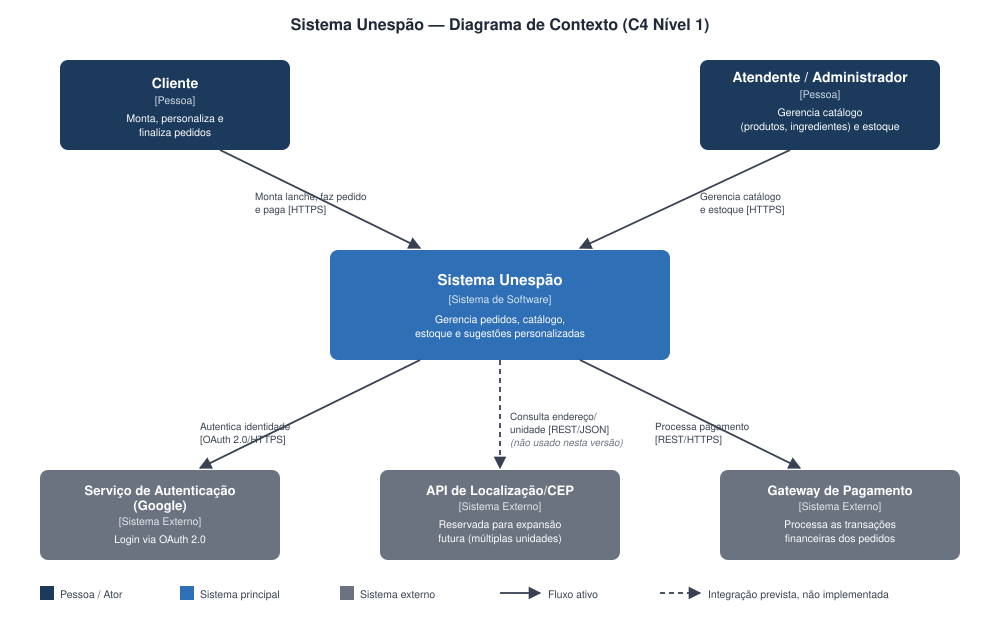
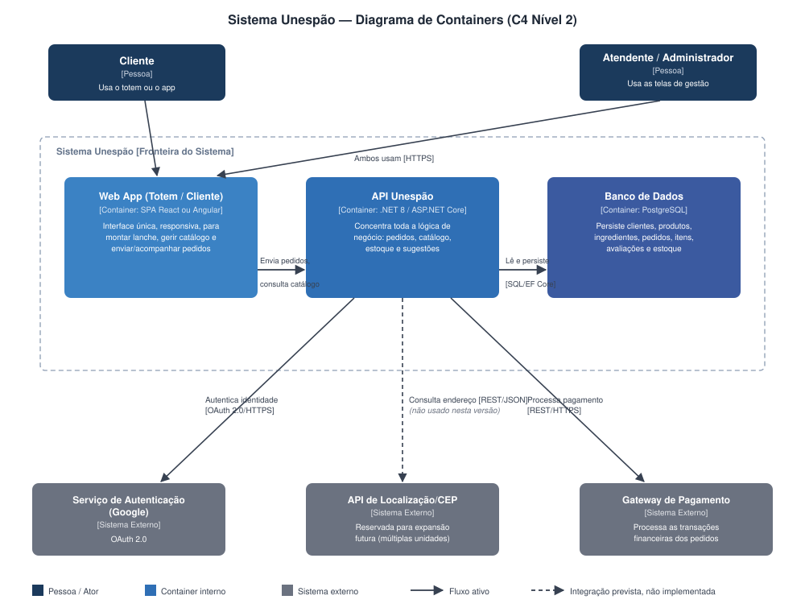

# Arquitetura do Sistema

Este capítulo apresenta a arquitetura proposta para o Sistema Unespão e as decisões que a sustentam. A ideia aqui não é repetir o que já foi dito na introdução sobre o problema, mas mostrar como o sistema foi estruturado para resolvê-lo: quais são suas fronteiras, que estilo arquitetural guia a organização do código, quais são as grandes peças que o compõem e por que certas escolhas técnicas foram tomadas em detrimento de outras. A base para esta seção é o levantamento arquitetural feito pela própria equipe ao longo do semestre, documentado no artefato "Sistema Unespão — Documentação Arquitetural (Modelo C4 e Princípios SOLID)", que usamos como referência de projeto e do qual reaproveitamos os diagramas C4 de Contexto e de Containers.

## Contexto e fronteiras do sistema

O Sistema Unespão automatiza o atendimento de uma padaria que vende lanches personalizáveis no estilo Subway/Spoleto: o cliente parte de um produto base (um tipo de pão, por exemplo) e vai adicionando os ingredientes que quiser, montando um item personalizado que compõe seu pedido. Essa interação acontece por dois pontos de acesso — um totem físico instalado na loja e o navegador do celular do cliente —, detalhados na seção de Contêineres a seguir, e o pedido só é considerado concluído quando o pagamento é processado.

**Figura 1** — Diagrama de Contexto do Sistema Unespão (C4 Nível 1), já com os dois atores humanos do sistema.

A Figura 1 traz o diagrama de contexto (C4 Nível 1), que trata o sistema como uma caixa preta e mostra apenas quem interage com ele de fora. Nela aparecem dois atores humanos — o Cliente, que monta, personaliza e finaliza pedidos, e o Atendente/Administrador da padaria, responsável pela gestão de catálogo (produtos base e ingredientes) e de estoque —, o próprio Sistema Unespão, e três sistemas externos com os quais ele troca informação: o Serviço de Autenticação do Google, a API de Localização/CEP e o Gateway de Pagamento. O diagrama também indica os protocolos de cada relação — o cliente fala com o sistema via HTTPS, e o sistema, por sua vez, usa HTTPS/OAuth 2.0 para autenticar o cliente junto ao Google, REST/JSON para consultar a API de CEP e REST/HTTPS para acionar o gateway de pagamento. Em resumo, a lógica de negócio inteira mora dentro da caixa "Sistema Unespão"; os três sistemas externos são fornecedores de capacidades específicas (identidade, endereço, dinheiro) que o Unespão consome, nunca o contrário.

A versão do diagrama de contexto produzida na iteração anterior da documentação arquitetural mostrava apenas o Cliente, de antes de o grupo formalizar o Atendente/Administrador como ator do sistema. A Figura 1 acima já foi atualizada para refletir os dois atores.

O sistema modela uma única loja da padaria Unespão, não uma rede de unidades. A API de Localização/CEP aparece no diagrama pensando numa expansão futura do produto — o dia em que a Unespão eventualmente abrir mais lojas e precisar direcionar o cliente para a unidade correta —, mas hoje ela permanece fora de uso efetivo; sua menção fica registrada no diagrama para essa eventualidade.

Ficam fora das fronteiras do sistema, por decisão de escopo do grupo: a logística de entrega (o modelo é de retirada na própria loja, via totem ou app, sem fluxo de delivery); a gestão financeira e contábil da padaria como negócio (o sistema processa o pagamento pontual de cada pedido através do gateway, mas não é um sistema de fluxo de caixa ou contabilidade); a gestão de funcionários e recursos humanos (folha de pagamento, escalas de trabalho); e o atendimento presencial que eventualmente aconteça em paralelo ao canal digital, por ser operação humana da padaria e não uma funcionalidade de software.

## Estilo ou padrão arquitetural

Optamos por Clean Architecture, organizada como uma arquitetura em camadas com fluxo unidirecional de dependências. Na prática, o backend é dividido em camadas concêntricas — Controllers, Services, Repositories/External Adapters e Domain Models — e cada camada só pode depender da camada imediatamente abaixo dela, nunca o contrário. As entidades de domínio (Cliente, Pedido, Estoque, e assim por diante) não conhecem nenhuma camada superior; quem depende delas são os repositórios e os serviços, não o inverso.

A escolha está ligada aos objetivos de qualidade definidos no capítulo de Introdução. A confiabilidade da informação de estoque, por exemplo, exige que a lógica de baixa de insumos fique concentrada num único lugar e não espalhada por controllers ou por chamadas ad hoc ao banco — é o que o Princípio da Responsabilidade Única (SRP) garante ao isolar essa lógica dentro de um EstoqueService dedicado, único ponto do sistema autorizado a decidir como o estoque é debitado após um pedido. Já o objetivo de segurança dos dados e das transações do cliente se apoia no Princípio da Inversão de Dependência (DIP): os serviços de negócio, como o PedidoService, dependem apenas de interfaces (IGatewayPagamentoAdapter, IPedidoRepository) e nunca de implementações concretas, o que mantém credenciais de integrações externas — tokens do Google, chaves do gateway de pagamento — isoladas dentro dos adapters, sem vazamento para as camadas de negócio.

O capítulo de Projeto de Componentes retoma cada princípio SOLID com mais profundidade, classe por classe; aqui a escolha aparece como decisão de alto nível porque orienta a arquitetura descrita nas seções seguintes.

## Contêineres e componentes

**Figura 2** — Diagrama de Containers do Sistema Unespão (C4 Nível 2).

A Figura 2 mostra o diagrama de containers (C4 Nível 2), que abre a caixa preta do diagrama anterior e revela as três peças tecnológicas que formam o Sistema Unespão.

O primeiro container é o Web App (Totem e Cliente): um único SPA construído em React ou Angular (a escolha definitiva entre as duas stacks fica para a equipe fechar durante o desenvolvimento), rodando em modo responsivo tanto na tela do totem físico quanto no navegador do cliente, sem app móvel separado nem código duplicado entre os dois pontos de acesso. É essa mesma interface, adaptada ao tamanho de tela de cada dispositivo, que tanto o Cliente quanto o Atendente/Administrador usam, com permissões diferenciadas por perfil controladas pela API: o Cliente monta o lanche, consulta o cardápio disponível (já refletindo o estoque) e finaliza o pedido, enquanto o Atendente/Administrador acessa as telas de gestão de catálogo e de estoque. O segundo container é a API Unespão, escrita em .NET 8 com ASP.NET Core, que concentra toda a lógica de negócio do sistema — cadastro de produtos e ingredientes, composição de itens personalizados, controle de estoque, cancelamento ou edição de item do pedido antes da confirmação do pagamento, histórico de pedidos e geração de sugestões personalizadas. O terceiro é o banco de dados PostgreSQL, responsável por persistir clientes, produtos base, ingredientes, pedidos, itens personalizados, avaliações e estoque.

A comunicação entre esses containers segue um padrão importante para a segurança do sistema: o Web App fala com a API Unespão via HTTPS/JSON, e é só a API que acessa o banco (via Entity Framework Core com o provider Npgsql) e que se comunica com os três sistemas externos do diagrama de contexto. Nem o Google Auth, nem a API de CEP, nem o gateway de pagamento são acessados diretamente pelo frontend — toda integração externa passa pela API, que guarda tokens e credenciais fora do alcance do navegador do cliente, viabilizando o objetivo de segurança mencionado na seção anterior.

Do ponto de vista de componentes internos da API (C4 Nível 3, detalhado no capítulo de Projeto de Componentes), a organização segue seis grupos alinhados ao estilo em camadas: Controllers na porta de entrada HTTP, Services concentrando as regras de negócio, Repositories abstraindo a persistência, External Adapters isolando a comunicação com sistemas de terceiros, Domain Models representando as entidades ricas do domínio, e a camada de Infrastructure (o UnespaoDbContext) mapeando esses modelos para o esquema relacional do PostgreSQL.

## Decisões arquiteturais relevantes

| Decisão | Motivação | Consequências |
|---|---|---|
| Adotar Clean Architecture / arquitetura em camadas com fluxo unidirecional de dependências | Isolar a lógica de negócio de detalhes de infraestrutura, facilitando testes e reduzindo o custo de trocar uma peça tecnológica sem afetar as demais. | Mais interfaces e classes de mapeamento entre camadas; em compensação, cada camada é testável isoladamente e trocar banco ou gateway fica restrito a Repositories e External Adapters. |
| Centralizar toda comunicação com sistemas externos na API Unespão, nunca no frontend | Evitar que tokens de autenticação e credenciais de pagamento fiquem expostos no navegador/totem do cliente. | Todo fluxo de autenticação e pagamento passa por uma chamada adicional ao backend, o que acrescenta uma etapa de rede mas concentra a superfície de segurança em um único ponto auditável. |
| Usar um único SPA responsivo (React ou Angular) em vez de app móvel nativo separado (ver seção de Contêineres) | Atender totem e navegador do cliente com o mesmo frontend e backend, sem duplicar código. | Toda regra de negócio fica no backend, evitando inconsistência entre o que aparece no totem e no navegador. |
| Modelar uma loja única, mantendo a API de CEP apenas como integração prevista (ver seção de Contexto) | O escopo do projeto cobre uma padaria só. | A integração de CEP não é implementada nesta versão; sua menção evita redesenhar o contexto numa expansão futura. |
| Isolar a lógica de estoque em um EstoqueService dedicado (SRP) | Garantir a confiabilidade da informação de estoque, objetivo de qualidade de prioridade alta definido na Introdução. | Único ponto de responsabilidade para a baixa de insumos, reduzindo o risco de inconsistência entre o cardápio exibido e o estoque físico. |
| Depender de abstrações nos serviços de negócio, isolando credenciais nos External Adapters (DIP) | Suportar a segurança dos dados e transações do cliente sem acoplar a lógica de pedido a uma implementação específica de gateway ou autenticação. | Facilita testes com dependências fake e permite trocar/adicionar um gateway de pagamento criando um novo adapter, sem alterar o PedidoService. |

## Restrições de arquitetura

A stack tecnológica já está definida e não é objeto de discussão neste projeto: backend em .NET 8 com ASP.NET Core, persistência em PostgreSQL e o frontend SPA descrito na seção de Contêineres. Trata-se de uma restrição herdada da documentação arquitetural produzida anteriormente pelo próprio grupo e mantida como decisão de projeto consolidada.

O sistema é desenvolvido no contexto da disciplina de Engenharia de Software II, na UNESP, o que traz restrições próprias de um trabalho acadêmico: prazo de entrega fixo dentro do semestre letivo, equipe pequena e sem dedicação exclusiva ao projeto, e a exigência de que a documentação evidencie explicitamente os conceitos vistos em aula (Modelo C4, princípios SOLID, entre outros), não apenas o funcionamento do software em si.

Há também três restrições de integração obrigatórias, não triviais de contornar sem redesenhar a arquitetura: autenticação via Google OAuth 2.0, processamento financeiro via gateway de pagamento externo, e a API de CEP reservada para a expansão a múltiplas lojas já discutida nas seções anteriores. As três partem exclusivamente da API Unespão, nunca do frontend, pela mesma decisão de segurança da tabela acima.
