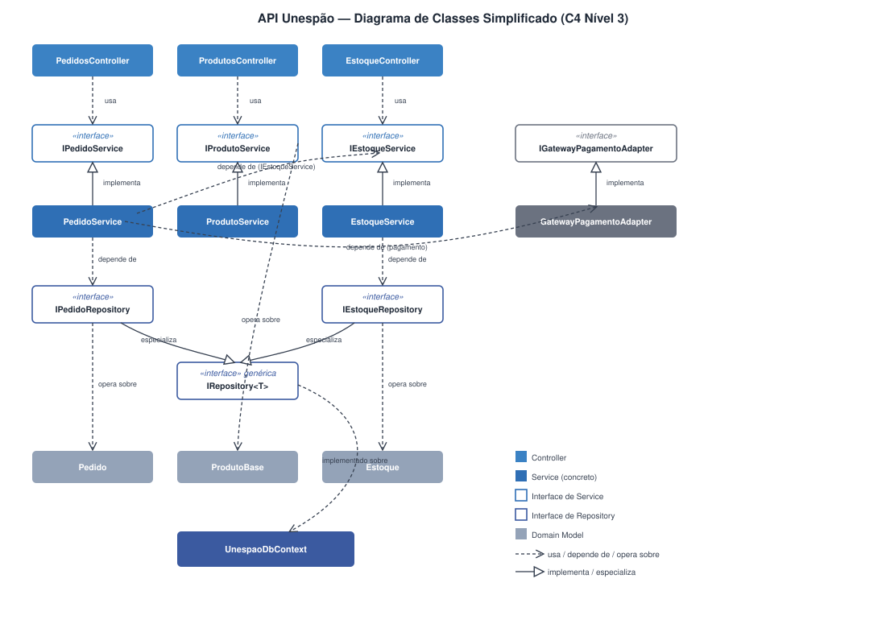
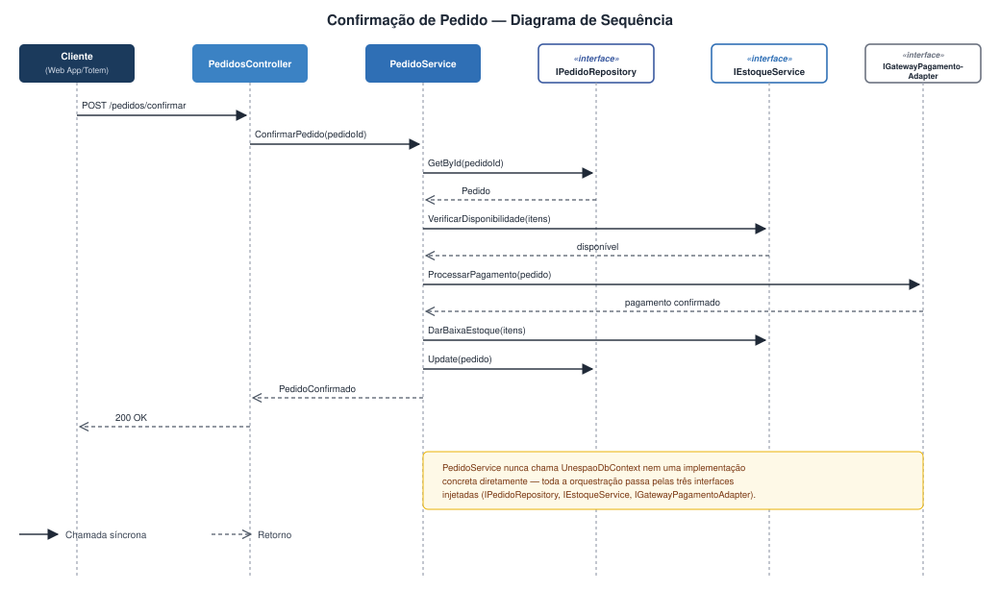
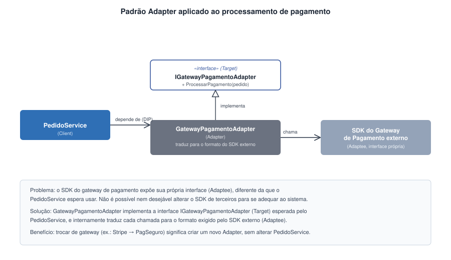
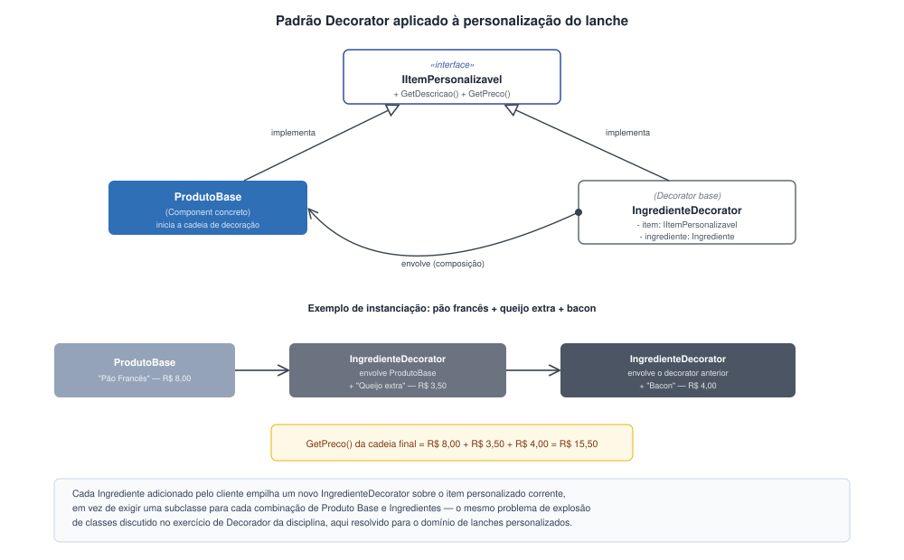

# Projeto de Componentes

## Visão geral dos componentes

A API Unespão (.NET 8 / ASP.NET Core) é o único container que concentra lógica de negócio no sistema: o Web App/Totem funciona apenas como camada de apresentação, e o banco PostgreSQL só é acessado através dela. Internamente essa API está organizada em seis grupos de componentes, com fluxo de dependência unidirecional — Controllers chamam Services, que por sua vez dependem de Repositories e de External Adapters; ambos operam sobre os Domain Models, e a persistência efetiva passa pela camada de Infrastructure (DbContext). Essa organização segue os princípios de Clean Architecture: cada camada conhece apenas a camada imediatamente abaixo dela, e os Domain Models não dependem de nenhuma outra camada.

A tabela a seguir resume os componentes e suas responsabilidades.

| Componente | Responsabilidade principal |
|---|---|
| Controllers (`ClientesController`, `PedidosController`, `ProdutosController`, `AvaliacoesController`, `EstoqueController`) | Receber requisições HTTP do frontend, validar dados de entrada, delegar a execução aos serviços apropriados e devolver respostas em JSON. Não contêm regra de negócio. |
| Services (`ClienteService`, `ProdutoService`, `PedidoService`, `AvaliacaoService`, `EstoqueService`, `SugestaoPersonalizadaService`) | Concentrar a lógica de domínio, coordenar chamadas a repositórios e adapters externos e garantir a consistência de operações que envolvem mais de uma entidade (por exemplo, criar um pedido e dar baixa no estoque). |
| Repositories (`IRepository<T>` e as interfaces específicas `IClienteRepository`, `IPedidoRepository`, `IProdutoRepository`, `IAvaliacaoRepository`, `IEstoqueRepository`, com suas implementações concretas) | Abstrair o acesso a dados, expondo uma interface padronizada de operações CRUD sobre as entidades de domínio, usando Entity Framework Core e o provider Npgsql. |
| External Adapters (`GoogleAuthAdapter`, `LocalizacaoAdapter`, `GatewayPagamentoAdapter`) | Isolar a comunicação com sistemas externos (autenticação Google, consulta de CEP e gateway de pagamento), traduzindo o formato exigido por cada API externa para o modelo interno da aplicação. |
| Domain Models (`Cliente`, `ProdutoBase`, `Ingrediente`, `ItemPersonalizado`, `Pedido`, `AvaliacaoPrato`, `Estoque`) | Representar as entidades de negócio e suas regras, sem depender de nenhuma outra camada da aplicação. |
| Infrastructure (`UnespaoDbContext`) | Mapear os Domain Models para o esquema relacional do PostgreSQL e gerenciar a conexão com o banco via Entity Framework Core. |

Do ponto de vista de quem usa o sistema, os dois atores do minimundo acionam grupos distintos de Controllers: o Cliente interage com `ClientesController`, `PedidosController` e `AvaliacoesController` (cadastro, autenticação, montagem/edição de pedido personalizado, pagamento e avaliação de pratos); já o Atendente/Administrador da padaria — ator de perfil mais simples, responsável pelo CRUD de catálogo e estoque — opera por meio de `ProdutosController` e `EstoqueController`. Essa separação de Controllers por ator já reflete, na camada de apresentação da API, a distinção de perfis que motiva a existência do `EstoqueService` como ponto único de manipulação de estoque, detalhado na seção seguinte.

Optamos por manter essa granularidade, com camadas bem definidas em vez de uma organização mais "achatada", porque ela conversa diretamente com dois dos objetivos de qualidade definidos no capítulo de Introdução. Um é a confiabilidade da informação de estoque, que depende de a lógica de baixa de insumos estar concentrada e isolada em um único componente (`EstoqueService`). O outro é a segurança dos dados e transações do cliente, que exige que credenciais de terceiros (Google, gateway de pagamento) fiquem restritas aos Adapters e nunca cheguem ao frontend.

## Detalhamento dos componentes principais

Dos seis grupos, três concentram a maior parte da complexidade e do risco de mudança do sistema: os Services, os Repositories e os External Adapters. É neles que detalhamos a seguir responsabilidades, interfaces e dependências. Como o Sistema Unespão é um projeto orientado a objetos, o diagrama de classes UML simplificado abaixo resume os grupos de componentes e as principais interfaces e dependências entre eles; o texto que segue detalha cada um.



**Figura 3** — Diagrama de classes simplificado da API Unespão (C4 Nível 3), com os grupos de componentes mais relevantes e suas dependências.

Na leitura do diagrama, as setas tracejadas com ponta aberta ("usa"/"depende de") indicam dependência em tempo de execução via injeção de construtor, enquanto as setas de implementação de interface ligam cada Service à sua abstração correspondente — é essa cadeia (Controller → interface de Service → Service concreto → interface de Repository/Adapter) que materializa a Clean Architecture descrita na seção anterior: nenhuma seta cruza diretamente para uma classe concreta de outra camada.

**PedidoService.** É o componente mais crítico do sistema, pois orquestra o ciclo de vida completo de um pedido: criação, edição ou cancelamento de itens antes da confirmação de pagamento (requisito adotado pelo grupo), personalização dos itens e processamento do pagamento. Suas dependências são todas abstrações — `IPedidoRepository`, `IEstoqueService` e `IGatewayPagamentoAdapter` — nunca as classes concretas correspondentes. Essa decisão não é incidental: é o que permite trocar o gateway de pagamento ou substituir o repositório por uma versão em memória nos testes sem tocar em uma linha do serviço.

Para tornar concreto esse fluxo de criação/confirmação de pedido — o mais crítico do sistema — o diagrama de sequência a seguir mostra a interação entre `PedidosController`, `PedidoService` e as abstrações que ele consome, sem detalhar o Domain Model interno:



**Figura 4** — Diagrama de sequência da confirmação de pedido, do `PedidosController` até as três interfaces que o `PedidoService` orquestra.

O diagrama evidencia que `PedidoService` nunca chama diretamente o `UnespaoDbContext` nem uma implementação concreta de gateway: toda a orquestração passa pelas três interfaces injetadas, o que é o que possibilita, por exemplo, substituir `GatewayPagamentoAdapter` por um dublê de teste sem alterar essa sequência de chamadas.

**EstoqueService.** Cuida exclusivamente da disponibilidade de produtos base e ingredientes, incluindo a baixa de insumos quando um pedido é confirmado. A separação desse componente do `PedidoService` é uma decisão deliberada de projeto: como o objetivo de qualidade "confiabilidade da informação de estoque" tem prioridade alta, isolar essa lógica em uma única classe reduz a chance de uma alteração na regra de pedidos afetar, por efeito colateral, o controle de estoque, e vice-versa. Na leitura do grupo, esse componente também é o ponto natural de extensão para os requisitos de CRUD de catálogo e estoque operados pelo Atendente/Administrador: as operações de cadastro e ajuste de estoque desse ator, expostas via `ProdutosController` e `EstoqueController`, passam pelo mesmo `EstoqueService`, e não por um caminho paralelo.

**IRepository\<T\> e as implementações concretas.** A camada de Repositories é construída sobre uma interface genérica, `IRepository<T>`, que define as operações CRUD comuns a todas as entidades, complementada por interfaces específicas (`IClienteRepository`, `IPedidoRepository` etc.) que acrescentam métodos próprios do domínio, como `GetClienteWithHistorico`. Cada Service depende apenas da interface, nunca da implementação concreta que fala com o PostgreSQL, o que possibilita a existência de implementações alternativas para teste, como `MockPedidoRepository`, discutida na seção seguinte. Essa relação de especialização (`IPedidoRepository` e `IEstoqueRepository` estendendo `IRepository<T>`) é exatamente o que o diagrama de classes acima representa pelas setas de generalização entre essas interfaces.

**External Adapters.** `GoogleAuthAdapter`, `LocalizacaoAdapter` e `GatewayPagamentoAdapter` encapsulam, cada um, a comunicação com um sistema externo específico do C4 Nível 1 (Serviço de Autenticação Google, API de Localização/CEP e Gateway de Pagamento, respectivamente). Como já vale para os Repositories, cada adapter é acessado pelos Services por meio de uma interface própria (`IGoogleAuthAdapter`, `ILocalizacaoAdapter`, `IGatewayPagamentoAdapter`), nunca pela classe concreta — é essa abstração que o `ClienteService` consome ao delegar a validação do token do Google ao `GoogleAuthAdapter` por trás de `IGoogleAuthAdapter`, no mesmo espírito do DIP já discutido para `IGatewayPagamentoAdapter` na seção de Princípios de projeto. Nenhum deles é chamado diretamente pelo frontend: a API Unespão sempre medeia essas integrações, o que mantém tokens e credenciais fora do navegador do cliente. Vale registrar que, como decidido no escopo do produto, a API de Localização/CEP é um recurso pensado para uma futura expansão a múltiplas unidades; no escopo atual, de loja única, o `LocalizacaoAdapter` existe na arquitetura mas não tem uso funcional imediato.

**UnespaoDbContext.** Fecha o fluxo de dependências mapeando os Domain Models para o esquema relacional via Entity Framework Core, expondo um `DbSet<>` para cada entidade persistente (Clientes, ProdutosBase, Ingredientes, Pedidos, ItensPersonalizados, AvaliacoesPrato e Estoque). É o único ponto do sistema que conhece o dialeto do PostgreSQL; substituir o banco de dados por outro SGBD afetaria, em tese, apenas essa classe e as implementações concretas dos Repositories.

## Princípios de projeto

Os cinco princípios SOLID orientaram as decisões de projeto da API Unespão. Em vez de tratá-los como uma lista teórica, procuramos, para cada um, indicar o problema concreto de projeto que ele resolveu no sistema, complementando a análise com o trecho de código do construtor de `PedidoService` a seguir, que evidencia de forma direta a aplicação de DIP e ISP:

```csharp
public class PedidoService : IPedidoService
{
    private readonly IPedidoRepository _pedidoRepository;
    private readonly IEstoqueService _estoqueService;
    private readonly IGatewayPagamentoAdapter _gatewayPagamento;

    public PedidoService(
        IPedidoRepository pedidoRepository,
        IEstoqueService estoqueService,
        IGatewayPagamentoAdapter gatewayPagamento)
    {
        _pedidoRepository = pedidoRepository;
        _estoqueService = estoqueService;
        _gatewayPagamento = gatewayPagamento;
    }

    // ConfirmarPedido, AdicionarItem, RemoverItem, etc.
}
```

Nenhum dos três parâmetros do construtor é uma classe concreta (`PedidoRepository`, `EstoqueService` ou `GatewayPagamentoAdapter`): todos são interfaces, resolvidas em tempo de execução pelo container de injeção de dependência do ASP.NET Core. É esse trecho — junto do diagrama de classes da seção anterior — que sustenta concretamente as discussões de DIP e ISP abaixo.

**Responsabilidade única (SRP).** Cada Service tem um único motivo para mudar. `PedidoService` cuida só do ciclo de vida do pedido; `EstoqueService`, só de estoque e baixa de insumos; `AvaliacaoService`, só de feedback de pratos; `SugestaoPersonalizadaService`, só de recomendações. O ganho prático é direto: se a regra de pontuação de uma avaliação mudar, apenas `AvaliacaoService` é tocado, sem risco de regressão em pedidos ou estoque. Os Controllers seguem a mesma lógica, cada um respondendo a um conjunto coeso de endpoints.

**Aberto/fechado (OCP).** A interface genérica `IRepository<T>` permite acomodar novas entidades sem alterar código já existente, bastando criar uma nova implementação. O caso mais ilustrativo, porém, é o dos adapters de pagamento: trocar o gateway de Stripe por PagSeguro, ou adicionar suporte a Pix, significa criar uma nova classe que implementa `IGatewayPagamentoAdapter` — o mesmo parâmetro `gatewayPagamento` do construtor acima passaria a receber outra implementação —, sem que `PedidoService` precise mudar uma única linha. Essa substituibilidade de gateways é a aplicação mais concreta de OCP no sistema, e é justamente o padrão Strategy que a sustenta — retomamos esse ponto na seção de padrões de projeto.

**Substituição de Liskov (LSP).** Qualquer implementação de `IPedidoRepository` precisa poder substituir outra sem que `PedidoService` perceba diferença de comportamento. É o que garante, por exemplo, que `PedidoRepository` (a implementação real sobre PostgreSQL) e `MockPedidoRepository` (uma implementação em memória usada em teste) sejam intercambiáveis do ponto de vista do serviço que os consome — ambas encaixam no mesmo parâmetro `pedidoRepository` do construtor. O cuidado aqui é que as implementações não podem quebrar as garantias do contrato: se `IPedidoRepository.GetById` promete devolver um `Pedido` válido, toda implementação precisa honrar isso, sob risco de falhas silenciosas em produção que só apareceriam ao trocar a implementação usada.

**Segregação de interfaces (ISP).** Em vez de uma interface única e genérica concentrando toda a lógica de serviço, o sistema define interfaces dedicadas — `IClienteService`, `IPedidoService`, `IAvaliacaoService`, `IEstoqueService`, `ISugestaoPersonalizadaService` — cada uma expondo apenas os métodos relevantes ao seu domínio. O mesmo raciocínio se aplica aos repositórios: `IRepository<T>` cobre o CRUD genérico, e interfaces como `IClienteRepository` acrescentam apenas os métodos específicos daquela entidade. O efeito é que cada Controller depende só do que usa (`ClientesController` não é forçado a conhecer métodos de estoque ou de pagamento), o que mantém o acoplamento baixo e permite que cada interface evolua de forma independente. No construtor de `PedidoService` isso aparece como três parâmetros estreitos e específicos (`IPedidoRepository`, `IEstoqueService`, `IGatewayPagamentoAdapter`), em vez de uma única interface genérica de "serviços" que agregasse métodos não usados por esse Service.

**Inversão de dependência (DIP).** `PedidoService` não conhece nenhuma classe concreta: suas dependências são sempre interfaces — `IPedidoRepository`, `IEstoqueService`, `IGatewayPagamentoAdapter` —, exatamente como declarado no construtor acima, nunca `PedidoRepository`, `EstoqueService` ou `GatewayPagamentoAdapter` diretamente. Quem resolve essas dependências em tempo de execução é o container de injeção de dependência do ASP.NET Core, que registra as implementações concretas como provedoras de cada interface e as injeta no construtor de cada Service. Esse é, possivelmente, o princípio com maior impacto estrutural no projeto: é ele que sustenta a testabilidade (basta injetar uma implementação fake), a possibilidade de trocar o banco de dados afetando só a camada de Repositories, e o baixo acoplamento entre todas as camadas descritas na seção anterior.

## Padrões de projeto

Documentamos aqui apenas os padrões cuja aplicação está de fato evidenciada na arquitetura do sistema.

**Repository.** Problema: a lógica de negócio dos Services não deveria depender diretamente de detalhes de acesso a dados (Entity Framework Core, SQL, provider Npgsql). Solução adotada: uma interface genérica `IRepository<T>` com as operações CRUD comuns, especializada por interfaces como `IPedidoRepository` e `IClienteRepository` para métodos próprios de cada entidade, cada uma com sua implementação concreta sobre PostgreSQL. Participantes: os Services (clientes do padrão), as interfaces de repositório e suas implementações concretas, e o `UnespaoDbContext` por trás delas. Benefício obtido: a lógica de negócio permanece isolada da tecnologia de persistência, e a substituição de uma implementação real por uma implementação de teste em memória (`MockPedidoRepository`) se torna possível sem alterar o código que a consome, o que viabiliza a estratégia de testes de unidade descrita no capítulo correspondente.

**Adapter.** Problema: o sistema precisa se comunicar com três serviços externos heterogêneos (autenticação Google via OAuth 2.0, API de Localização/CEP via REST/JSON, Gateway de Pagamento via REST/HTTPS), cada um com seu próprio protocolo e formato de dados, sem que essa heterogeneidade vaze para a lógica de negócio. Solução adotada: três classes — `GoogleAuthAdapter`, `LocalizacaoAdapter` e `GatewayPagamentoAdapter` — que traduzem as chamadas da aplicação para o formato exigido por cada API externa e traduzem de volta as respostas para o modelo interno. Participantes: os Services que consomem os adapters (por exemplo, `PedidoService` consumindo `IGatewayPagamentoAdapter`) e as classes adapter propriamente ditas. Benefício obtido: o sistema fica isolado de mudanças nesses serviços externos; se o gateway de pagamento mudar sua API, o impacto fica contido no adapter correspondente, sem se propagar para `PedidoService` ou para os Controllers.



**Figura 5** — Estrutura clássica do padrão Adapter (Target/Adapter/Adaptee) instanciada com as classes reais do caso de pagamento: `PedidoService` (Client) depende apenas de `IGatewayPagamentoAdapter` (Target); `GatewayPagamentoAdapter` implementa essa interface e traduz cada chamada para o SDK do gateway externo (Adaptee), cuja interface própria o sistema não controla.

**Injeção de Dependência (via container do ASP.NET Core).** Problema: se cada Service instanciasse diretamente suas dependências concretas (o repositório do EF Core, o adapter HTTP do gateway de pagamento), o acoplamento entre camadas inviabilizaria tanto a testabilidade quanto a substituição de implementações discutidas no DIP. Solução adotada: registrar cada interface (`IPedidoRepository`, `IEstoqueService`, `IGatewayPagamentoAdapter` etc.) e sua implementação concreta correspondente no container de injeção de dependência nativo do ASP.NET Core, deixando que o framework resolva e injete as instâncias apropriadas nos construtores dos Services e Controllers em tempo de execução — o construtor de `PedidoService` mostrado na seção de Princípios de projeto é exatamente o ponto de extensão que esse container preenche. Participantes: praticamente todos os componentes das camadas de Services, Repositories e External Adapters, mediados pelo container. Benefício obtido: as dependências entre camadas passam a ser configuradas externamente, e não codificadas dentro das classes, o que é a base técnica que sustenta tanto a testabilidade (substituir uma implementação real por um mock nos testes) quanto a substituição de tecnologia (trocar de gateway de pagamento ou de banco de dados) sem alterar código consumidor.

**Strategy.** Problema: diferentes gateways de pagamento (Stripe, PagSeguro, Pix) implementam o processamento de uma cobrança de formas distintas, e o sistema precisa poder trocar ou adicionar um gateway em produção sem recompilar ou alterar `PedidoService`. Solução adotada: cada gateway é encapsulado em uma implementação concreta de `IGatewayPagamentoAdapter`, e o `PedidoService` opera exclusivamente sobre essa abstração, recebendo a implementação ativa por injeção de dependência — o mesmo mecanismo de configuração externa discutido na Injeção de Dependência acima. Participantes: `IGatewayPagamentoAdapter` (a estratégia comum), `GatewayPagamentoAdapter` e suas variantes por provedor (os algoritmos concretos), e `PedidoService` (o contexto que consome a estratégia sem conhecer qual está ativa). Benefício obtido: trocar o "algoritmo" de processamento de pagamento passa a ser uma decisão de configuração, não de código — o mesmo caso já discutido como aplicação de OCP na seção anterior.

**Decorator.** Problema: um Item Personalizado nasce de um Produto Base ao qual o cliente vai adicionando um número variável de Ingredientes, cada um contribuindo com seu próprio preço e descrição ao resultado final — exatamente o problema de explosão de subclasses discutido no exercício de Decorador da disciplina (lá, um carro com opcionais de navegação e cor; aqui, um lanche com ingredientes). Representar cada combinação possível de ingredientes como uma subclasse de `ProdutoBase` inviabilizaria o cardápio, já que o número de combinações cresce exponencialmente com o número de ingredientes disponíveis. Solução adotada: `ProdutoBase` e cada ingrediente adicionado implementam uma interface comum (`IItemPersonalizavel`, com `GetDescricao()` e `GetPreco()`); ao montar o pedido, cada `Ingrediente` selecionado envolve o item personalizado corrente em um `IngredienteDecorator`, que soma seu próprio preço ao preço acumulado e anexa sua descrição à do item envolvido, formando uma cadeia de decoradores equivalente ao objeto `ItemPersonalizado` final. Participantes: `IItemPersonalizavel` (o componente comum), `ProdutoBase` (o componente concreto que inicia a cadeia) e `IngredienteDecorator` (o decorador concreto, parametrizado pelo `Ingrediente` que representa). Benefício obtido: qualquer combinação de ingredientes é montada dinamicamente em tempo de execução, sem uma única subclasse nova; adicionar um ingrediente ao cardápio não exige tocar em `ProdutoBase` nem em nenhuma combinação já existente; e o preço é recalculado incrementalmente à medida que decoradores são empilhados — o mesmo mecanismo que sustenta a atualização de preço em tempo real na interface do cliente, descrita no capítulo de Projeto de Interface do Usuário.



**Figura 6** — Estrutura do padrão Decorator (Component/ConcreteComponent/Decorator) aplicada à montagem de um Item Personalizado, com um exemplo concreto de instanciação (pão francês com queijo extra e bacon) mostrando como o preço se acumula a cada decorador empilhado.