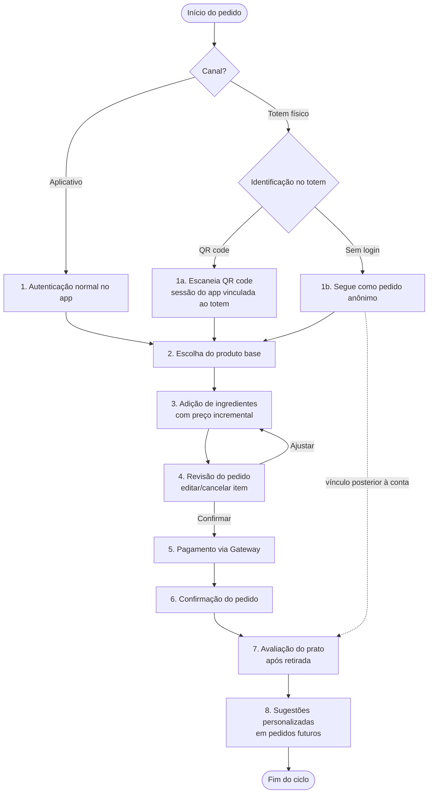
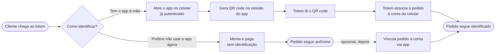

# Projeto de Interface do Usuário

Este capítulo descreve os fluxos de interação com o Sistema Unespão para os dois perfis de usuário previstos no Minimundo: o Cliente, que monta e finaliza pedidos pelo totem físico da loja ou pelo aplicativo móvel, e o Atendente/Administrador da padaria, responsável pela gestão de catálogo e estoque. Diferente dos capítulos de arquitetura, aqui o foco não é a estrutura interna do software, mas a experiência de quem está usando o sistema em cada um desses papéis.

## Estado atual dos artefatos de interface

Até o momento desta versão do documento, o grupo não produziu protótipos visuais do sistema, nem em Figma nem em qualquer outra ferramenta de prototipação. O trabalho se concentrou primeiro na modelagem do domínio e na arquitetura, já documentadas nos capítulos anteriores, e a etapa de design de telas ainda não começou. Optamos, assim, por descrever os fluxos de forma textual e estrutural, complementados por diagramas de atividade, sem propor layouts, paletas de cor ou composições de tela específicas — qualquer detalhe desse tipo seria invenção nesta fase do projeto e não corresponderia a uma decisão real da equipe. Quando os protótipos forem produzidos numa iteração futura, este capítulo deve ser atualizado para referenciá-los. Essa ausência de protótipos vale para os dois perfis de usuário tratados neste capítulo, Cliente e Atendente/Administrador.

Isso não quer dizer que o projeto de interface esteja em branco. As decisões estruturais do fluxo, como a ordem das etapas, o que cada uma exige do usuário e, em particular, como funciona a autenticação num dispositivo compartilhado, já foram discutidas e fixadas pelo PO, e são justamente o conteúdo deste capítulo.

## Canais de interação do Cliente

O cliente acessa o sistema por um destes dois canais, que compartilham a mesma lógica de negócio no backend (API Unespão) e diferem principalmente na forma de entrada:

- **Totem físico**, instalado na loja, pensado para o cliente que já está presencialmente na padaria e decide o pedido ali mesmo. É um dispositivo compartilhado entre vários clientes ao longo do dia.
- **Aplicativo móvel**, no celular do próprio cliente, usado tanto para pedir remotamente quanto para complementar a experiência do totem — por exemplo, quando o cliente já chega com uma conta autenticada.

Os passos do pedido (escolha do produto, personalização, pagamento) são conceitualmente os mesmos nos dois canais. A diferença que importa do ponto de vista de projeto de interface está na etapa de autenticação, tratada separadamente mais adiante.

## Fluxo principal de interação do cliente

O fluxo de ponta a ponta, do início do pedido até a etapa posterior de avaliação, segue as seguintes etapas:

**1. Identificação no canal.** No aplicativo, o cliente autentica normalmente — contas de clientes recorrentes têm histórico de pedidos associado, conforme o Minimundo. No totem, a identificação segue a decisão de projeto detalhada na próxima seção: QR code vinculando a sessão do app, ou pedido anônimo com vínculo posterior.

**2. Escolha do produto base.** O cliente seleciona o item que servirá de ponto de partida para a personalização, por exemplo um tipo de pão ou uma base de salada, dentre os produtos disponíveis em estoque.

**3. Adição de ingredientes com atualização incremental do preço.** A cada ingrediente adicionado ou removido, o valor do item é recalculado e exibido imediatamente, sem que o cliente precise avançar de tela para saber o custo da personalização. Essa atualização incremental existe porque o preço final de um Item Personalizado só é conhecido depois da composição completa de Ingredientes, e faz sentido que o cliente acompanhe esse custo enquanto ainda está decidindo: evita surpresa na etapa de revisão e reduz a chance de abandono do pedido.

**4. Revisão do pedido.** Antes de seguir para o pagamento, o cliente vê o resumo dos itens personalizados escolhidos, com a possibilidade de cancelar ou editar qualquer item. Este ponto está alinhado ao requisito funcional já definido pelo PO de permitir alteração do pedido antes da confirmação do pagamento.

**5. Pagamento.** O pedido é encaminhado ao Gateway de Pagamento via API Unespão, nunca diretamente do frontend, como descrito na arquitetura, e o cliente acompanha o status da transação.

**6. Confirmação.** Com o pagamento aprovado, o pedido é registrado e o cliente recebe a confirmação, encerrando o ciclo ativo de compra.

**7. Avaliação do prato (momento posterior).** Depois de retirar o pedido, o cliente pode registrar uma Avaliação de Prato: nota e comentário sobre o Item Personalizado consumido.

**8. Sugestões personalizadas em pedidos futuros.** Em pedidos seguintes, o sistema usa o Histórico de Pedidos e as avaliações anteriores para propor combinações que o cliente tende a gostar, reduzindo o número de decisões que ele precisa tomar do zero a cada visita.

O diagrama de atividade abaixo representa essas oito etapas, já incluindo a bifurcação de identificação no totem (QR code vs. pedido anônimo) detalhada na seção seguinte:

O fluxo é o mesmo nos dois canais a partir do passo 2; a diferença está inteiramente na etapa 1, onde o totem bifurca entre a rota de QR code e a rota anônima. A seta pontilhada de "pedido anônimo" até a etapa de avaliação indica que esse vínculo com a conta, quando feito, pode ocorrer depois da compra, permitindo que o histórico e as avaliações do pedido anônimo passem a contar retroativamente para o cliente.

## Decisão de projeto: autenticação no totem físico

Um ponto que exigiu decisão explícita do PO foi como identificar o cliente no totem, já que esse dispositivo é compartilhado por múltiplos clientes ao longo do dia, diferente do celular no app, que é de uso pessoal.

Duas alternativas foram descartadas antes de chegar à decisão final. A primeira era exigir um fluxo completo de OAuth 2.0, o mesmo usado pelo Serviço de Autenticação do Google já presente na arquitetura, diretamente no totem. Isso obrigaria o cliente a digitar credenciais num teclado público, o que é ruim tanto em usabilidade (login lento, digitação incômoda numa tela touch) quanto em segurança, pela exposição da senha ou do token de sessão num equipamento compartilhado: se a sessão de um cliente não fosse encerrada corretamente, o próximo cliente poderia herdar o carrinho ou o histórico de quem usou o totem antes dele. A segunda alternativa cogitada foi autenticar apenas por CPF, descartada por não constituir autenticação forte (qualquer pessoa que soubesse o CPF de outra poderia se passar por ela) e por não ter respaldo em nenhuma das fontes do projeto.

A solução adotada combina duas rotas, e o cliente escolhe entre elas no início do fluxo do totem:

- **QR code vinculado à sessão do app.** O cliente abre o aplicativo no próprio celular, já autenticado ali, e usa essa sessão para gerar um QR code que o totem lê. A partir daí, o totem apenas associa o pedido em andamento à conta já logada no celular: nenhuma credencial é digitada no dispositivo público, e a sessão fica atrelada ao aparelho do cliente, não ao totem.
- **Pedido anônimo, com vínculo posterior.** Se o cliente preferir não usar o app naquele momento, o totem permite montar e pagar o pedido sem identificação alguma. Depois, ele pode vincular esse pedido à sua conta, por exemplo abrindo o app e associando o comprovante ou pedido recente, passando a contar para o Histórico de Pedidos e para as Sugestões Personalizadas.

Essa decisão evita reintroduzir no totem o mesmo risco que motivou o descarte do OAuth completo, a sessão cruzada entre clientes num equipamento compartilhado, e ainda preserva o benefício de histórico e recomendação para quem quiser se identificar. O custo é aceitar que uma parcela dos pedidos feitos no totem fique anônima, sem entrar no cálculo de Sugestões Personalizadas, a menos que o cliente faça questão de vincular depois.

O diagrama a seguir isola essa bifurcação, detalhando o que cada rota exige do dispositivo e da conta:

## Interface do Atendente/Administrador

Além do Cliente, o sistema prevê um segundo perfil de usuário: o Atendente/Administrador da padaria, responsável pela gestão de catálogo (produtos base e ingredientes) e de estoque. Esse é um perfil de uso interno, operado por quem trabalha na padaria, e não pelo cliente final — por isso seu canal de acesso é tratado separadamente do totem e do aplicativo do cliente.

Diferente do Cliente, não há indicação nas fontes do projeto (Minimundo ou arquitetura) de um dispositivo dedicado para esse perfil. O caminho mais plausível, dado que a arquitetura já prevê um frontend web (SPA React ou Angular) consumindo a mesma API Unespão, é que o Atendente/Administrador acesse um painel administrativo web, separado da experiência de totem/app do cliente, autenticado com suas próprias credenciais de funcionário. Como já indicado, também aqui não há telas prototipadas; o que segue é uma descrição textual e estrutural das operações que ele precisa suportar, sem propor layout algum.

A interface desse perfil é estruturalmente mais simples que a do Cliente: não envolve personalização de pedido, atualização incremental de preço, pagamento ou avaliação de prato. Suas operações centrais são de CRUD (criação, leitura, atualização e remoção) sobre duas famílias de dados:

- **Catálogo.** Cadastro e manutenção dos Produtos Base (por exemplo, tipos de pão ou bases de salada) e dos Ingredientes disponíveis para personalização, incluindo os dados que o Cliente vê no momento de montar seu pedido, como nome, descrição e preço unitário de cada ingrediente.
- **Estoque.** Atualização das quantidades disponíveis de cada Produto Base e Ingrediente, refletindo o que efetivamente pode ser oferecido ao Cliente no totem e no aplicativo. É essa informação de estoque que impede, por exemplo, que um cliente monte um pedido com um ingrediente esgotado.

Essas operações de catálogo e estoque feitas pelo Atendente/Administrador alimentam diretamente os dados que o Cliente consome nos passos 2 e 3 do fluxo principal descrito anteriormente: a lista de produtos disponíveis e o preço de cada ingrediente vêm dessa gestão interna. Por isso, embora os dois perfis usem canais e telas distintas, suas interfaces não são independentes — são duas pontas do mesmo ciclo de dados do sistema.
