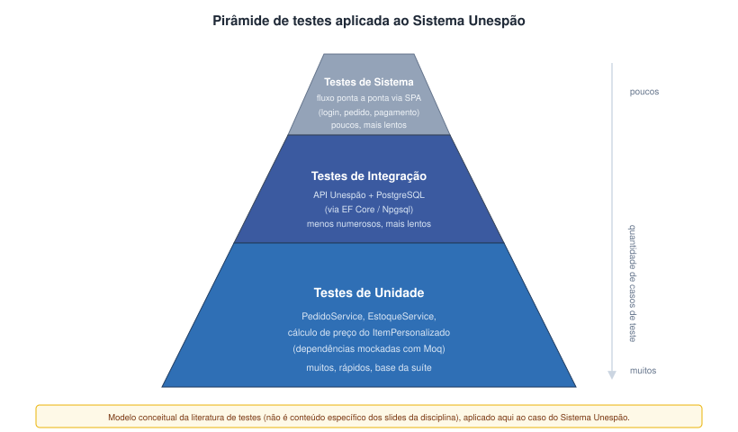

# Especificação e Estratégia de Testes

O Sistema Unespão concentra praticamente toda a lógica de negócio na API Unespão (.NET 8 / ASP.NET Core), enquanto o Web App/Totem funciona como uma camada de apresentação relativamente fina, que consome essa API via HTTPS/JSON. Por isso a estratégia de testes da equipe se concentra no backend: é ali que vivem as regras que decidem se um pedido pode ser fechado, se há insumo suficiente no estoque e como um item personalizado tem seu preço calculado. Este capítulo descreve os níveis de teste adotados, os critérios usados para selecionar o que testar e as ferramentas do ecossistema .NET que sustentam essa estratégia.

Um ponto de partida importante é a própria arquitetura em camadas descrita no capítulo de Arquitetura (Controllers → Services → Repositories/External Adapters → Domain Models, com fluxo de dependência unidirecional). Como os Services dependem de abstrações — `IPedidoRepository`, `IEstoqueRepository`, `IGatewayPagamentoAdapter`, entre outras — e não de classes concretas, a própria organização do código já favorece testes isolados: basta substituir a implementação real por um dublê de teste sem tocar em nenhuma linha da classe testada.

## Planejamento e níveis de teste

Adotamos três níveis de teste, cada um respondendo a uma pergunta diferente sobre o sistema.

Os **testes de unidade** verificam se uma classe de negócio se comporta corretamente quando isolada de tudo à sua volta. O alvo principal aqui são os Services (`PedidoService`, `EstoqueService`, `ProdutoService` etc.) e os Domain Models com lógica própria, como `ItemPersonalizado`. A pergunta que esse nível responde é: esta unidade de código faz o que deveria, dado um conjunto controlado de entradas?

Já os **testes de integração** verificam se as peças que se comunicam entre si — no nosso caso, principalmente a API Unespão e o banco PostgreSQL via Entity Framework Core/Npgsql — realmente conversam corretamente quando combinadas. Aqui a pergunta muda: não é mais "a lógica está certa isoladamente", e sim se o Repository gera o SQL certo, se o mapeamento do EF Core está coerente com o schema e se a operação persiste e recupera os dados como esperado.

Não chegamos a formalizar um nível de teste de sistema (ponta a ponta, via totem/app) neste trabalho. A ausência de protótipos de interface implementados (ver capítulo de Interface do Usuário) torna esse nível prematuro no momento, e registramos isso como um limite consciente do escopo, não como uma lacuna esquecida.



**Figura 1** — A pirâmide de testes é um modelo conceitual conhecido da literatura de teste de software (não um conteúdo específico dos slides da disciplina), usado aqui apenas para situar visualmente os dois níveis que de fato adotamos — muitos testes de unidade rápidos na base, menos testes de integração acima — e por que o nível de sistema, no topo, fica de fora nesta fase.

A prioridade de testes segue a mesma lógica dos objetivos de qualidade definidos na Introdução: como "Confiabilidade da informação de estoque" e "Segurança dos dados e transações do cliente" foram marcados como prioridade Alta, `EstoqueService` e o fluxo de pagamento (`PedidoService` + `IGatewayPagamentoAdapter`) recebem mais atenção de teste do que, por exemplo, `SugestaoPersonalizadaService`, cujo objetivo de qualidade associado ("Relevância das sugestões personalizadas") tem prioridade Média.

## Testes de unidade

A ideia central desta seção é a mesma trabalhada no exercício de testes de unidade da disciplina (`ProcessadorVendas` com e sem `Mockito`), só que transposta para o ecossistema real do projeto: em vez de JUnit e Mockito sobre um `ProcessadorVendas` de exemplo, usamos **xUnit** como framework de teste e **Moq** como biblioteca de mocks sobre as classes reais do Sistema Unespão, escritas em C#.

### PedidoService com IPedidoRepository mockado

O `PedidoService` é o candidato mais natural para essa técnica, porque o próprio documento de arquitetura já cita esse par como exemplo de LSP: `PedidoRepository` (PostgreSQL real) e `MockPedidoRepository`/dublê de teste devem ser intercambiáveis do ponto de vista do `PedidoService`. Um teste sem mock, usando uma implementação em memória do repositório, ficaria assim:

```csharp
public class PedidoServiceSemMockTests
{
    [Fact]
    public void FinalizarPedido_ComEstoqueSuficiente_RetornaSucesso()
    {
        var repositorioEmMemoria = new PedidoRepositoryEmMemoria();
        var estoqueService = new EstoqueServiceEmMemoria();
        var gatewayFake = new GatewayPagamentoSempreAprova();

        var service = new PedidoService(repositorioEmMemoria, estoqueService, gatewayFake);

        var resultado = service.FinalizarPedido(pedidoId: 1);

        Assert.Equal(StatusPedido.Confirmado, resultado.Status);
    }
}
```

Essa abordagem funciona, mas exige manter classes auxiliares "de mentira" (`PedidoRepositoryEmMemoria`, `GatewayPagamentoSempreAprova`) só para viabilizar o teste, e qualquer mudança de comportamento nelas pode mascarar um defeito real. A abordagem com Moq resolve isso criando o dublê dinamicamente, a partir da própria interface:

```csharp
public class PedidoServiceComMockTests
{
    private readonly Mock<IPedidoRepository> _repositorioMock;
    private readonly Mock<IEstoqueService> _estoqueMock;
    private readonly Mock<IGatewayPagamentoAdapter> _gatewayMock;
    private readonly PedidoService _service;

    public PedidoServiceComMockTests()
    {
        _repositorioMock = new Mock<IPedidoRepository>();
        _estoqueMock = new Mock<IEstoqueService>();
        _gatewayMock = new Mock<IGatewayPagamentoAdapter>();
        _service = new PedidoService(_repositorioMock.Object, _estoqueMock.Object, _gatewayMock.Object);
    }

    [Fact]
    public void FinalizarPedido_PagamentoAprovado_AtualizaStatusParaConfirmado()
    {
        var pedido = new Pedido { Id = 1, Status = StatusPedido.Aberto, ValorTotal = 35.90m };
        _repositorioMock.Setup(r => r.GetById(1)).Returns(pedido);
        _estoqueMock.Setup(e => e.HaSaldoSuficiente(pedido)).Returns(true);
        _gatewayMock.Setup(g => g.Cobrar(It.IsAny<string>(), pedido.ValorTotal)).Returns(true);

        var resultado = _service.FinalizarPedido(1);

        Assert.Equal(StatusPedido.Confirmado, resultado.Status);
        _repositorioMock.Verify(r => r.Update(It.Is<Pedido>(p => p.Status == StatusPedido.Confirmado)), Times.Once);
    }

    [Fact]
    public void FinalizarPedido_PagamentoRecusado_MantemPedidoAbertoENaoDaBaixaNoEstoque()
    {
        var pedido = new Pedido { Id = 2, Status = StatusPedido.Aberto, ValorTotal = 20.00m };
        _repositorioMock.Setup(r => r.GetById(2)).Returns(pedido);
        _estoqueMock.Setup(e => e.HaSaldoSuficiente(pedido)).Returns(true);
        _gatewayMock.Setup(g => g.Cobrar(It.IsAny<string>(), pedido.ValorTotal)).Returns(false);

        var resultado = _service.FinalizarPedido(2);

        Assert.Equal(StatusPedido.PagamentoRecusado, resultado.Status);
        _estoqueMock.Verify(e => e.DarBaixa(It.IsAny<Pedido>()), Times.Never);
    }
}
```

O segundo teste é particularmente útil porque exercita um cenário que seria trabalhoso de forçar com um gateway real (uma recusa de pagamento) e verifica uma consequência que importa para a confiabilidade do estoque: se o pagamento falha, a baixa de insumos não pode acontecer. Isolar o `PedidoService` do gateway de pagamento real também evita que a suíte de testes dependa de rede, de credenciais ou da disponibilidade de um serviço externo, o que tornaria os testes lentos e instáveis.

### EstoqueService: baixa de insumos

O `EstoqueService` concentra uma regra sensível: dar baixa nos insumos (produtos base e ingredientes) associados aos itens de um pedido, sem deixar o saldo ficar negativo. Aqui a atenção recai sobre os casos de borda: saldo exato, saldo insuficiente, item com quantidade zero.

```csharp
[Fact]
public void DarBaixa_ComSaldoExato_ZeraEstoqueSemErro()
{
    var estoqueMock = new Mock<IEstoqueRepository>();
    estoqueMock.Setup(r => r.GetByIngredienteId(10)).Returns(new Estoque { QuantidadeDisponivel = 2 });

    var service = new EstoqueService(estoqueMock.Object);
    service.DarBaixa(ingredienteId: 10, quantidade: 2);

    estoqueMock.Verify(r => r.Update(It.Is<Estoque>(e => e.QuantidadeDisponivel == 0)), Times.Once);
}

[Fact]
public void DarBaixa_ComSaldoInsuficiente_LancaExcecaoENaoAtualizaEstoque()
{
    var estoqueMock = new Mock<IEstoqueRepository>();
    estoqueMock.Setup(r => r.GetByIngredienteId(10)).Returns(new Estoque { QuantidadeDisponivel = 1 });

    var service = new EstoqueService(estoqueMock.Object);

    Assert.Throws<EstoqueInsuficienteException>(() => service.DarBaixa(ingredienteId: 10, quantidade: 2));
    estoqueMock.Verify(r => r.Update(It.IsAny<Estoque>()), Times.Never);
}
```

Na prática, o segundo caso é o mais importante dos dois: ele garante que uma tentativa de baixa acima do saldo disponível não corrompe silenciosamente o estoque, algo diretamente ligado ao objetivo de qualidade de confiabilidade da informação de estoque discutido na Introdução.

### Cálculo de preço de um ItemPersonalizado

Diferente dos exemplos anteriores, o cálculo de preço de um `ItemPersonalizado` é um caso de teste de unidade sem qualquer dependência externa a isolar: é lógica pura sobre os dados do próprio objeto (preço base do produto mais a soma dos preços adicionais dos ingredientes selecionados). Isso o torna um bom exemplo de teste "sem mock", no espírito do primeiro teste do exercício de referência da disciplina:

```csharp
public class ItemPersonalizadoTests
{
    [Fact]
    public void CalcularPrecoTotal_ComIngredientesAdicionais_SomaPrecoBaseEAdicionais()
    {
        var produtoBase = new ProdutoBase { Nome = "Pão Francês", PrecoBase = 8.00m };
        var ingredientes = new List<Ingrediente>
        {
            new Ingrediente { Nome = "Queijo extra", PrecoAdicional = 3.50m },
            new Ingrediente { Nome = "Bacon", PrecoAdicional = 4.00m }
        };

        var item = new ItemPersonalizado(produtoBase, ingredientes);

        Assert.Equal(15.50m, item.PrecoTotal);
    }

    [Fact]
    public void CalcularPrecoTotal_SemIngredientesAdicionais_IgualAoPrecoBase()
    {
        var produtoBase = new ProdutoBase { Nome = "Pão Francês", PrecoBase = 8.00m };
        var item = new ItemPersonalizado(produtoBase, new List<Ingrediente>());

        Assert.Equal(8.00m, item.PrecoTotal);
    }
}
```

### Critério de seleção das unidades testadas

Não pretendemos cobrir cada classe do sistema com o mesmo nível de detalhe, e o próprio template não pede isso. Priorizamos Services que carregam regra de negócio com impacto financeiro ou de integridade de dados (`PedidoService`, `EstoqueService`) e modelos de domínio com lógica não trivial (`ItemPersonalizado`). Classes essencialmente wrappers finos, como boa parte dos Controllers, que segundo a documentação de arquitetura "não contêm regras de negócio", recebem menos atenção em teste de unidade e acabam cobertas, na prática, pelos testes de integração descritos a seguir.

## Testes de integração

Os testes de integração do Unespão têm como alvo principal a comunicação entre a API Unespão e o banco PostgreSQL, via Entity Framework Core e o provider Npgsql, a mesma dupla usada em produção, conforme descrito na visão de containers da arquitetura. A ideia é validar o que um teste de unidade com repositório mockado não consegue: se o mapeamento das entidades (`Pedido`, `ItemPersonalizado`, `Estoque` etc.) está correto, se uma consulta EF Core realmente traz os dados esperados e se uma transação que abrange múltiplas tabelas (por exemplo, criar um pedido e dar baixa no estoque na mesma operação) se comporta de forma consistente.

Optamos por uma estratégia próxima do que a literatura chama de integração *bottom-up*: primeiro validamos isoladamente cada Repository contra um banco de testes real (não mockado), e só depois testamos a composição completa via Controllers, exercitando a pilha inteira (Controller → Service → Repository → banco). Faz sentido nesse projeto porque os Repositories são a camada mais próxima da tecnologia externa (PostgreSQL) e mais provável de esconder problemas que um mock nunca revelaria, como um mapeamento incorreto de coluna ou uma constraint de chave estrangeira violada.

Na prática, esses testes usam um banco PostgreSQL de teste dedicado — subindo, por exemplo, via um container Docker específico para a suíte de testes, para não interferir no banco de desenvolvimento —, populado com uma massa de dados mínima antes de cada execução e limpo ao final dela, de forma que os testes não dependam da ordem de execução nem deixem resíduo entre si.

```csharp
public class PedidoRepositoryIntegrationTests : IClassFixture<PostgresTestFixture>
{
    private readonly UnespaoDbContext _context;

    public PedidoRepositoryIntegrationTests(PostgresTestFixture fixture)
    {
        _context = fixture.CreateContext();
    }

    [Fact]
    public async Task Add_PersisteEBuscaPedidoComItens()
    {
        var repositorio = new PedidoRepository(_context);
        var pedido = new Pedido { ClienteId = 1, Status = StatusPedido.Aberto, ValorTotal = 12.50m };

        await repositorio.AddAsync(pedido);
        var pedidoRecuperado = await repositorio.GetByIdAsync(pedido.Id);

        Assert.NotNull(pedidoRecuperado);
        Assert.Equal(StatusPedido.Aberto, pedidoRecuperado.Status);
    }
}
```

Quanto à regressão, o critério adotado é simples: toda a suíte de testes de unidade e de integração é executada localmente antes de abrir um pull request, e novamente antes de qualquer merge no `main`. Como o repositório já opera com pull requests revisados antes da integração — prática visível no próprio histórico de commits do projeto —, o teste de regressão se encaixa naturalmente nesse fluxo: um PR que quebra um teste existente evidencia isso antes da revisão ser concluída, e a expectativa da equipe é não mesclar código com testes falhando.

## Critérios de conclusão e cobertura

Decidimos não adotar uma meta numérica de cobertura (por exemplo, "mínimo de 80% de linhas/branches cobertas") como critério de conclusão dos testes. Essa escolha está em linha com a decisão já tomada, no capítulo de Introdução, de não especificar RNFs quantificados como desempenho de pico ou portabilidade neste trabalho acadêmico. Caso o template de entrega do curso traga um campo obrigatório de "percentual de cobertura alvo", esse campo deve ser preenchido como "(A PREENCHER PELO GRUPO)" em vez de se inventar um número só para completar a seção.

O critério de conclusão adotado é qualitativo e segue a mesma priorização Alta/Média usada na tabela de objetivos de qualidade da Introdução. Para funcionalidades de prioridade Alta — usabilidade, confiabilidade da informação de estoque e segurança de dados/transações, o que na prática cobre `EstoqueService`, autenticação, pagamento e o CRUD de catálogo/estoque do Atendente/Administrador, além da edição ou cancelamento de um item antes da confirmação do pagamento — exigimos ao menos um teste de unidade cobrindo o caminho de sucesso e um cobrindo o principal caminho de falha ou exceção de cada método público relevante (saldo insuficiente, pagamento recusado, valor inválido), com uso de mock via Moq para isolar dependências externas como o gateway de pagamento e os repositórios, seguindo o mesmo princípio de DIP já adotado no capítulo de Arquitetura. Para funcionalidades de prioridade Média, como as sugestões personalizadas, basta um teste de unidade cobrindo o caminho de sucesso.

Esse critério nos parece mais defensável do que perseguir um número de cobertura isolado: um teste que apenas exercita a linha de código sem testar de fato as condições de contorno passa despercebido em métricas de cobertura de linha, mas não reduz o risco real de defeito. Num projeto acadêmico de escopo definido — não um produto em produção com SLA — um critério baseado em risco e prioridade de requisito tende a ser mais rastreável do que uma meta percentual arbitrária, que muitas vezes acaba incentivando testes de baixo valor só para "bater número".

Isso não significa abrir mão de medir cobertura. A cobertura de linha e de branch, obtida via Coverlet, continua sendo acompanhada como métrica de diagnóstico, útil sobretudo para identificar Services críticos que ficaram sem nenhum teste, o que seria um sinal de alarme independentemente de qualquer meta numérica. O que fica descartado é usá-la como gate de aprovação com limiar obrigatório.

## Automação e ferramentas

A stack de testes do backend .NET 8/ASP.NET Core do Sistema Unespão é composta por:

- **xUnit** como framework de teste unitário e de integração, por ser o padrão de facto para projetos .NET modernos e por sua boa integração com o `dotnet test` e com o Visual Studio/VS Code;
- **Moq** como biblioteca de mocks, usada para isolar Services de suas dependências (`IPedidoRepository`, `IEstoqueService`, `IGatewayPagamentoAdapter`, `IGoogleAuthAdapter` etc.) nos testes de unidade, no mesmo espírito do Mockito no exercício de referência da disciplina, porém aplicado às interfaces reais do projeto;
- **Coverlet** como ferramenta de medição de cobertura de código, integrado ao `dotnet test` via `dotnet test --collect:"XPlat Code Coverage"`, gerando relatórios que podem ser convertidos para HTML (por exemplo, via ReportGenerator) e inspecionados da mesma forma que o relatório do JaCoCo no exercício em Java;
- um **banco PostgreSQL de teste**, isolado do banco de desenvolvimento/produção, para os testes de integração que envolvem EF Core/Npgsql.

Essa troca de ferramentas em relação ao material de referência é deliberada: o exercício de testes de unidade da disciplina usa Java, JUnit, Mockito e JaCoCo, mas o backend real do Sistema Unespão é .NET 8/ASP.NET Core em C#. Documentar as ferramentas Java descreveria uma stack que o projeto não usa; por isso a equipe optou por reproduzir a mesma forma de trabalho — teste com e sem dublê, medição de cobertura — dentro do ecossistema .NET efetivamente empregado no projeto.

Sobre integração contínua: não há, até o momento, um pipeline de CI/CD configurado no repositório para rodar essa suíte automaticamente a cada push ou pull request. O que existe hoje é o uso de pull requests com revisão antes do merge no `main`, como mostra o histórico de commits do projeto. A execução dos testes (`dotnet test`) e a geração do relatório de cobertura, portanto, ainda são feitas manualmente pelos desenvolvedores antes de abrir ou aprovar um PR. Fica registrado como recomendação de boas práticas, e não como algo já implementado, configurar um workflow de CI (por exemplo, GitHub Actions) que rode `dotnet test` com coleta de cobertura automaticamente a cada pull request, complementando a revisão humana já praticada nos PRs com uma verificação automática antes do merge.
