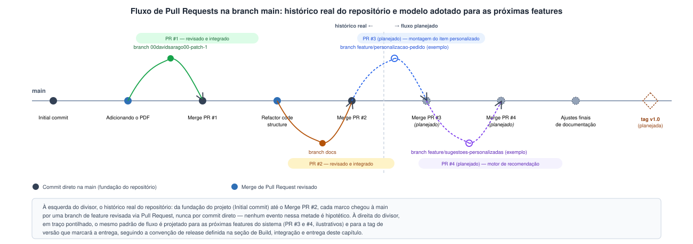

# Gestão de Configuração e Manutenção

Este capítulo descreve como os artefatos produzidos ao longo do projeto do Sistema Unespão são versionados e mantidos sob controle, e como uma alteração feita em qualquer ponto do sistema pode ser acompanhada até seu efeito nos demais artefatos relacionados.

## Repositório e itens de configuração

O projeto é versionado em um repositório Git hospedado no GitHub, com a branch `main` funcionando como ponto de referência para a versão consolidada do trabalho. O README atual descreve o repositório de forma sucinta como "nosso repositório para servir de KB do nosso projeto". Hoje esse repositório versiona os artefatos da documentação do projeto final: os capítulos em Markdown (`docs/*.md`), o documento fonte em LaTeX (`.tex`) e o PDF gerado a partir dele, os diagramas C4 e demais figuras (pasta `images/`) e o arquivo de referências bibliográficas (`refs.bib`).

A mesma disciplina de controle de configuração se estende ao código do Sistema Unespão à medida que a implementação avança, no mesmo repositório: o código-fonte da API back-end (.NET 8/ASP.NET Core), responsável pela lógica de negócio, pelos endpoints consumidos pelo front-end e pela integração com o gateway de pagamento e demais adaptadores externos; o código-fonte do front-end, o SPA definido no capítulo de Arquitetura; o código dos testes automatizados descritos no capítulo de Estratégia de Testes, versionado junto do código de produção que ele cobre; e as migrations do banco de dados, geradas via Entity Framework Core, que descrevem de forma incremental a evolução do esquema do PostgreSQL usado pelo sistema.

Configuração sensível recebe tratamento à parte, por política definida pela equipe: a connection string do PostgreSQL e as credenciais do gateway de pagamento nunca são commitadas em texto plano junto do código-fonte. O repositório versiona apenas um `appsettings.Development.json` com placeholders, enquanto os valores reais de cada ambiente (desenvolvimento, homologação, produção) são injetados via variáveis de ambiente no momento da implantação, com um `.gitignore` que exclui explicitamente qualquer `appsettings.*.json` que não seja o de placeholders. Esse mecanismo garante que um segredo vazado no histórico do Git simplesmente não existe, porque o segredo em si nunca chega a ser escrito no repositório.

Tratamos as migrations como item de configuração porque, assim como o código, elas precisam estar sincronizadas com a versão da aplicação que as acompanha: uma API em determinada versão espera um esquema de banco em estado compatível, e um descompasso aí quebra a aplicação mesmo com o código correto. Todos esses itens passam a conviver no mesmo repositório que hoje já versiona a documentação, o que ajuda a manter código e documentação evoluindo juntos: quando uma decisão de arquitetura muda, o diagrama C4 correspondente e o texto do capítulo de Arquitetura são atualizados no mesmo conjunto de commits que a mudança de código que a motivou.

## Gestão de dependências e alterações

As dependências externas são gerenciadas separadamente em cada camada da aplicação, seguindo o gerenciador de pacotes padrão de cada ecossistema. No back-end, as dependências do .NET — bibliotecas do próprio ASP.NET Core, driver do PostgreSQL, pacote do Entity Framework Core, cliente do gateway de pagamento, entre outras — são declaradas no arquivo de projeto `.csproj` e resolvidas pelo NuGet, que também registra as versões exatas utilizadas. No front-end, as dependências do SPA são declaradas no `package.json` e gerenciadas pelo npm, com as versões efetivamente instaladas fixadas no arquivo de lock correspondente.

O histórico do repositório mostra que a equipe já adota Pull Requests como mecanismo de integração de mudanças à `main`, em vez de commits diretos, mesmo nesta fase de documentação: os merges de PR aparecem de forma explícita no próprio log do Git, como eventos distintos do desenvolvimento (detalhado na seção de Rastreabilidade a seguir). Esse mesmo fluxo é o que a equipe adota como padrão para a implementação do sistema: cada mudança passa por uma branch de feature revisada via Pull Request antes de chegar à `main`, o que dá à equipe um ponto de revisão antes que qualquer mudança chegue à versão principal do projeto.

Quando uma alteração afeta mais de um artefato — por exemplo, uma mudança na regra de negócio do estoque que exige ajuste na API, uma migration nova e um trecho do capítulo de Arquitetura que descreve o `EstoqueService` (o serviço responsável por isolar a lógica de estoque, conforme o princípio de responsabilidade única discutido no capítulo de Arquitetura) — essas mudanças entram no mesmo Pull Request, de modo que a revisão avalie o conjunto coerente em vez de partes soltas. É essa expectativa — descrever o conjunto de mudanças, os itens de configuração afetados e os testes correspondentes antes de solicitar revisão — que orienta cada Pull Request da equipe.

## Rastreabilidade

Um exemplo real e observável de rastreabilidade no projeto é o próprio histórico de integração via Pull Requests. O log do Git mostra, entre os commits mais recentes, os merges "Merge pull request #2 from 00davidsarago00/docs" e "Merge pull request #1 from 00davidsarago00/00davidsarago00-patch-1". Cada um desses merges corresponde a um Pull Request identificável (#1 e #2) que passou por revisão no GitHub antes de ser incorporado à `main`, ou seja, dá para partir do identificador do PR e chegar ao conjunto de commits e arquivos que ele trouxe para o projeto.

**Figura 1** — Metade esquerda: histórico real da branch `main`, do commit inicial ao Merge PR #2, cada marco chegado por uma branch de feature revisada via Pull Request. Metade direita, em traço pontilhado: o mesmo padrão de fluxo projetado para as próximas features do sistema, incluindo a tag de versão que marcará a entrega.

A rastreabilidade do projeto liga três pontas: o requisito ou funcionalidade (registrado como uma Issue do GitHub), o Pull Request que o implementa e os casos de teste que o cobrem. É esse o padrão que a equipe adota para cada mudança que introduz ou altera uma regra de negócio: por exemplo, a Issue que descreve o requisito de cancelamento de item antes da confirmação do pagamento é referenciada no Pull Request que introduz essa lógica em `PedidoService`, e esse mesmo PR inclui os testes de unidade que exercitam o caminho de sucesso e o de falha da funcionalidade. Isso permite, a qualquer momento, partir de um requisito e chegar ao commit exato que o implementou, ou partir de um caso de teste e identificar qual Issue e qual decisão de projeto o originaram.

## *Build*, integração e entrega

A equipe define um pipeline de integração contínua em GitHub Actions, acionado a cada Pull Request aberto contra a `main`, como parte do processo de build e entrega do sistema. O workflow restaura as dependências do back-end via NuGet, compila a API .NET, aplica as migrations do Entity Framework Core em um banco PostgreSQL de teste provisionado no próprio job, executa a suíte de testes de unidade e integração descrita no capítulo de Estratégia de Testes (com coleta de cobertura via Coverlet) e publica o relatório de cobertura resultante como artefato do workflow. Um Pull Request só pode ser mesclado à `main` depois que esse workflow termina com sucesso, o que transforma em verificação automática o controle de qualidade que a revisão humana do PR já pratica, e reduz a zero o risco de uma alteração quebrar o build da `main` sem que ninguém perceba antes da entrega.

A entrega do sistema em si segue o mesmo pipeline: um segundo workflow, disparado quando uma tag de versão é publicada na `main`, empacota a API .NET em uma imagem de contêiner, aplica as migrations pendentes no banco de produção e publica a nova versão da API e do SPA no ambiente de implantação, sem intervenção manual além da própria criação da tag.