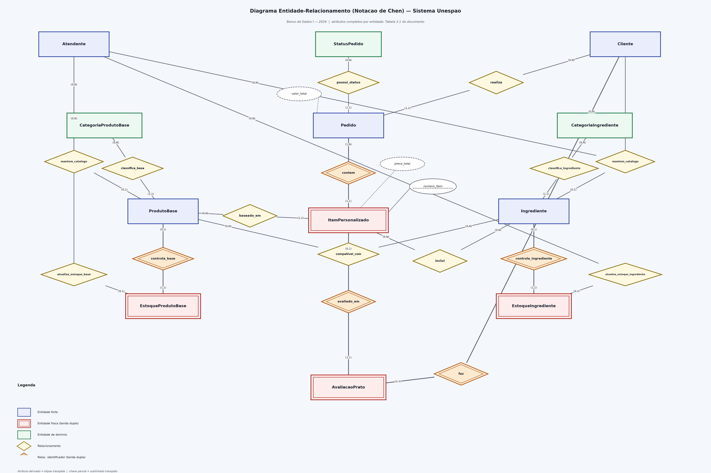

<!-- Última atualização: 2026-09-15 -->

# Parte I — Modelo Conceitual

Esta parte apresenta o minimundo do Sistema Unespão, as regras de negócio que
dele derivam e o Diagrama Entidade-Relacionamento (DER) resultante, em notação
de Chen.

A ordem de apresentação é deliberada e segue o princípio de que **as entidades
são derivadas do domínio, e não o contrário**: primeiro o cenário é descrito em
texto corrido, sem qualquer vocabulário de modelagem; em seguida as regras de
negócio explicitam o encadeamento de raciocínio entre os conceitos que emergem
desse texto; só então o DER formaliza esses conceitos como entidades,
relacionamentos e atributos. A tabela de entidades ao final é material de
apoio à leitura do diagrama, não a origem dele.

---

## 1. Descrição do minimundo

A Unespão é uma padaria de unidade única que decidiu reformular a maneira como
atende seus clientes. Até então, o pedido era feito verbalmente no balcão: o
cliente descrevia o que queria, o atendente anotava, e a montagem acontecia na
sequência. Esse arranjo funcionava enquanto o cardápio era fixo, mas passou a
ser um gargalo quando a casa adotou o modelo de montagem personalizada
popularizado por redes como Subway e Spoleto, no qual o próprio cliente decide
o que compõe o que vai consumir. Filas longas em horário de pico, pedidos
anotados de forma ambígua e divergências entre o que foi pedido e o que foi
entregue tornaram-se frequentes, e a padaria não dispunha de nenhum registro
do que cada cliente costumava consumir.

No cenário reformulado, o cliente inicia seu atendimento por um totem instalado
no salão ou pelo navegador do próprio celular, identificando-se por meio de sua
conta Google. A partir daí ele monta o que deseja consumir em duas etapas. Na
primeira, escolhe a fundação daquilo que vai comer — um pão artesanal, uma
massa especial ou uma base leve de salada — e essa escolha é obrigatória e
única: não existe montagem sem uma fundação, nem montagem sobre duas fundações
ao mesmo tempo. É ela que define o preço de partida e o formato do que será
preparado. Na segunda etapa, o cliente acrescenta a essa fundação os
complementos que quiser: proteínas, queijos, folhas e vegetais, molhos
artesanais e itens crocantes. Diferentemente da fundação, os complementos são
livres em número — o cliente pode não acrescentar nenhum e levar a preparação
simples, pode acrescentar vários, e pode inclusive pedir porção dupla de um
mesmo complemento. Cada complemento acrescentado tem preço próprio, que se
soma ao preço de partida da fundação.

Nem toda combinação, porém, faz sentido para a cozinha. A padaria mantém uma
definição, para cada fundação, de quais complementos podem ser aplicados sobre
ela e em que condições: alguns acompanham a fundação por padrão, já embutidos no
preço de partida, e outros são acréscimos pagos que só entram se o cliente os
solicitar. Combinações que a cozinha não prepara simplesmente não constam dessa
definição — é ela que impede que se peça brigadeiro sobre uma base de
salada. Essa
definição é uma característica da combinação entre uma fundação específica e um
complemento específico — não é uma propriedade do complemento isolado, já que o
mesmo queijo pode vir por padrão em um pão e ser um acréscimo opcional em uma
base de salada.

Tanto as fundações quanto os complementos são organizados em famílias, para que
o cliente consiga navegar pelo cardápio sem precisar percorrer uma lista única e
extensa. As fundações se agrupam por tipo de preparação, e os complementos se
agrupam por função na montagem. Essa organização é o que estrutura a
apresentação do cardápio no totem e no celular.

Uma vez montada a preparação, o cliente pode montar outras, quantas quiser, e
todas seguem juntas em um único atendimento, que é fechado de uma só vez. Cada
preparação existe apenas dentro daquele atendimento: ela é identificada pela
posição que ocupa nele — a primeira, a segunda, a terceira — e não faz sentido
falar de uma preparação avulsa, fora de um atendimento. O inverso também vale:
um atendimento sem nenhuma preparação não representa nada, porque é justamente o
conjunto de preparações que dá a ele existência e valor. Enquanto o pagamento
não é confirmado, o cliente ainda pode alterar ou remover qualquer preparação;
depois da confirmação, o conteúdo fica congelado, porque passa a ser o registro
do que a cozinha efetivamente deve produzir e do que foi cobrado.

O fechamento do atendimento se dá pelo pagamento, processado por um serviço
financeiro externo à padaria. A Unespão não guarda dados de cartão nem opera a
transação: ela apenas registra por qual meio o cliente optou e qual foi o
desfecho informado pelo serviço externo. Confirmado o pagamento, o atendimento
entra em um ciclo de vida acompanhado tanto pelo cliente quanto pela cozinha —
aguardando preparo, em preparo, pronto para retirada, concluído — ou é
encerrado por cancelamento. Esses estados não são livres: formam uma sequência
conhecida da operação, e a padaria precisa saber, a qualquer momento, em qual
deles cada atendimento se encontra.

Depois de consumir, o cliente é convidado a avaliar o que comeu. A avaliação
não se refere ao atendimento como um todo, e sim a uma preparação específica
dentro dele: quem pediu um sanduíche e uma salada no mesmo atendimento pode ter
gostado de um e não do outro, e uma nota única para o conjunto não diria nada
útil à padaria. A avaliação combina uma nota e um comentário livre, e só existe
enquanto existirem tanto o cliente que a emitiu quanto a preparação a que se
refere — ela não tem sentido isolada de nenhum dos dois. Cada cliente avalia
uma mesma preparação no máximo uma vez.

O acúmulo dessas avaliações, somado ao registro do que cada cliente já pediu ao
longo do tempo, é o que permite à padaria devolver valor a quem volta: na
próxima visita, o sistema sugere ao cliente as fundações e os complementos que
ele mais consome e melhor avaliou, encurtando a montagem de quem já sabe o que
quer. Por isso o histórico não é descartado — ele é mantido enquanto a conta do
cliente existir.

Do outro lado do balcão, há o trabalho de retaguarda. Um atendente da padaria é
responsável por cadastrar e manter o cardápio — quais fundações e complementos
estão disponíveis, a que preço, em que família se encaixam e quais combinações
são permitidas — e por manter atualizada a quantidade física de cada insumo em
estoque. Esse controle é o que sustenta a promessa feita ao cliente: um item
sem insumo disponível não pode ser oferecido no totem, sob pena de o cliente
montar algo que a cozinha não tem como produzir. Cada insumo tem uma quantidade
disponível e uma quantidade mínima abaixo da qual a operação precisa ser
avisada para repor. Como a confiabilidade dessa informação é crítica, a padaria
precisa saber quem foi o responsável pela última atualização de cada insumo e
quando ela ocorreu. O atendente não monta pedidos, não paga por clientes e não
administra contas de cliente — sua atuação se limita ao catálogo e ao estoque.

---

## 2. Regras de negócio e encadeamento entre os conceitos

As regras abaixo formalizam o minimundo e explicitam **por que** cada conceito
existe e como se liga aos demais. Elas são a ponte entre a narrativa da seção 1
e o diagrama da seção 3.

### 2.1 Por que fundação e complemento são conceitos distintos

A distinção entre o que o modelo chama de `ProdutoBase` (a fundação) e
`Ingrediente` (o complemento) não é uma classificação arbitrária de itens de
cardápio: os dois conceitos têm **papéis estruturais diferentes na montagem**,
e é essa diferença de papel que justifica entidades separadas.

| Critério | `ProdutoBase` | `Ingrediente` |
|---|---|---|
| Papel na montagem | Fundação estrutural — define formato e preparo | Complemento aplicado sobre a fundação |
| Cardinalidade por preparação | Exatamente **1** (obrigatória e única) | **0..N** (livre, inclusive nenhum) |
| Efeito no preço | Define o **preço de partida** | **Acresce** ao preço de partida |
| Existência sem o outro | Uma fundação sozinha é um item vendável | Um complemento sozinho não é vendável |
| Porção | Não se aplica — é sempre uma unidade | Admite porção múltipla (ex.: queijo duplo) |

**RN-01.** Toda preparação personalizada referencia exatamente uma fundação.
Não existe preparação sem fundação, nem preparação com duas fundações.

**RN-02.** Uma preparação personalizada pode referenciar de zero a N
complementos. Uma preparação sem nenhum complemento é válida (a fundação pura).

**RN-03.** O mesmo complemento pode ser aplicado mais de uma vez à mesma
preparação, na forma de **quantidade de porções** — e não pela repetição da
linha, que violaria a identificação da associação.

### 2.2 Por que a compatibilidade é uma entidade, e não um atributo

A versão anterior do modelo carregava em `Ingrediente` um atributo booleano
`Opcional`. Essa colocação estava incorreta, e a razão é de domínio, não de
técnica: **"ser opcional" não é uma propriedade do complemento isolado, mas da
combinação entre uma fundação específica e um complemento específico.** O mesmo
queijo pode acompanhar por padrão um pão artesanal e ser um acréscimo pago sobre
uma base de salada. Um atributo em `Ingrediente` só conseguiria representar uma
das duas situações.

**RN-04.** A padaria define, para cada par (fundação, complemento), se aquela
combinação é permitida e se o complemento acompanha a fundação por padrão — já
incluso no preço base — ou é um acréscimo pago, que só entra se solicitado.

A existência do par é, por si só, a regra de compatibilidade: sem ela, o banco
aceitaria brigadeiro em uma base de salada.

Daí a entidade associativa `ProdutoBaseIngredienteCompativel`, que existe
justamente para hospedar atributos que pertencem ao **par**, e não a nenhuma das
duas pontas isoladamente.

### 2.3 Por que as famílias de itens são entidades próprias

**RN-05.** Toda fundação pertence a exatamente uma família de fundações (ex.:
Pão Artesanal, Massa Especial, Base Leve). Todo complemento pertence a
exatamente uma família de complementos (ex.: Recheio/Proteína, Queijo,
Salada/Vegetal, Molho Artesanal, Crocante).

Modelar as famílias como `CategoriaProdutoBase` e `CategoriaIngrediente`, em vez
de repetir o nome da família como texto em cada item, elimina a redundância de
representação e garante que a mesma família seja grafada de uma única forma em
todo o cardápio. É também o que permite à padaria criar ou renomear uma família
sem varrer o catálogo item a item.

### 2.4 Por que `ItemPersonalizado` é uma entidade fraca de `Pedido`

Este é o ponto central do modelo. Uma preparação personalizada **não tem
existência independente do atendimento que a contém**: ela não é um item de
catálogo que possa ser consultado, reaproveitado ou vendido isoladamente — é a
materialização de uma escolha feita dentro de um atendimento específico, em um
momento específico, com os preços vigentes naquele momento. Retirado o
atendimento, a preparação perde qualquer sentido.

A dependência é, além disso, **mútua em termos de sentido de negócio**, e é isso
que responde à pergunta "por que um `Pedido` precisa obrigatoriamente de um
`ItemPersonalizado`": um atendimento é, por definição, o agrupamento de uma ou
mais preparações a serem pagas em conjunto. Um atendimento vazio não representa
nenhum fato do mundo real — não há o que preparar, não há o que cobrar, não há o
que entregar.

**RN-06.** `ItemPersonalizado` é uma **entidade fraca**, cuja existência e
identificação dependem de `Pedido`. Sua **chave parcial** é `numero_item`, um
sequencial que representa a posição da preparação dentro do atendimento (1, 2,
3, ...). O identificador completo é, portanto, a composição
(`pedido_id`, `numero_item`). O relacionamento `contem`, entre `Pedido` e
`ItemPersonalizado`, é um **relacionamento identificador**.

**RN-07.** Todo pedido contém no mínimo uma preparação personalizada
(participação total de `Pedido` no relacionamento `contem`).

**RN-08.** Enquanto o pagamento não estiver confirmado, preparações podem ser
adicionadas, alteradas ou removidas do atendimento. Após a confirmação do
pagamento, o conteúdo do atendimento torna-se imutável.

Uma consequência relevante da RN-06 se propaga para a entidade associativa
`ItemIngrediente`: por associar-se a uma entidade fraca, seu identificador
herda a chave composta do proprietário, resultando em
(`pedido_id`, `numero_item`, `ingrediente_id`).

### 2.5 Por que a avaliação se liga à preparação, e não ao atendimento

**RN-09.** A avaliação incide sobre uma preparação específica, não sobre o
atendimento como um todo. Um cliente que pediu um sanduíche e uma salada no
mesmo atendimento pode ter aprovado um e reprovado o outro; uma nota única para
o conjunto não informaria à padaria qual dos dois precisa de atenção.

**RN-10.** `AvaliacaoPrato` é uma **entidade fraca** que depende
simultaneamente do cliente que a emitiu e da preparação avaliada — ela não tem
sentido isolada de nenhum dos dois. Participa, portanto, de **dois
relacionamentos identificadores**: `faz` (com `Cliente`) e `avaliado_em` (com
`ItemPersonalizado`). Seu identificador é a composição
(`cliente_id`, `pedido_id`, `numero_item`).

**RN-11.** Cada cliente avalia uma mesma preparação no máximo uma vez, o que é
garantido pela própria composição do identificador da RN-10.

> **Nota de projeto — diferença deliberada entre o conceitual e o lógico.**
> No modelo conceitual, os dois vínculos de `AvaliacaoPrato` são representados
> explicitamente, porque ambos fazem parte da compreensão do domínio: uma
> avaliação é, de fato, "a opinião *de um cliente* sobre *uma preparação*".
> No **modelo lógico** (Parte II), entretanto, o vínculo direto com `Cliente` é
> **eliminado**, porque o cliente é alcançável por caminho já existente
> (`avaliacao_prato` → `item_personalizado` → `pedido` → `cliente`) e mantê-lo
> caracterizaria dependência transitiva, violando a 3FN. Essa eliminação é um
> resultado do **mapeamento do MER para o modelo relacional**, e está
> documentada e justificada na Parte II. A divergência entre os dois diagramas é
> intencional e esperada: o DER descreve o domínio; o modelo lógico descreve a
> estrutura relacional normalizada que o realiza.

### 2.6 Por que o status do pedido é uma entidade de domínio

**RN-12.** O ciclo de vida do atendimento percorre estados conhecidos e
ordenados da operação (aguardando pagamento, aguardando preparo, em preparo,
pronto para retirada, concluído), além do estado terminal de cancelamento.

Representar o estado como texto livre dentro de `Pedido` permitiria grafias
divergentes para o mesmo estado e impediria a padaria de associar ao estado
qualquer informação própria — sua posição na sequência do fluxo, ou se ele é
terminal. `StatusPedido` como entidade de domínio resolve ambos os pontos e
transfere a integridade do valor para o próprio modelo, em vez de deixá-la a
cargo da aplicação.

### 2.7 Por que o estoque foi desdobrado em duas entidades

A versão anterior do modelo mantinha uma única entidade `Estoque` com um
atributo `TipoItem` indicando se a linha se referia a uma fundação ou a um
complemento. Essa construção impede a declaração de integridade referencial:
não é possível estabelecer uma associação obrigatória a um alvo que varia
conforme o conteúdo de um atributo.

**RN-13.** Cada fundação possui no máximo um registro de estoque, e cada
complemento possui no máximo um registro de estoque.

`EstoqueProdutoBase` e `EstoqueIngrediente` são **entidades fracas** com
dependência de existência e de identificação total em seus proprietários
(`ProdutoBase` e `Ingrediente`, respectivamente). Não possuem chave parcial: a
cardinalidade 1:1 faz com que o identificador do proprietário identifique
integralmente o registro de estoque.

**RN-14.** Todo registro de estoque mantém a quantidade disponível, a quantidade
mínima que dispara alerta de reposição, o instante da última atualização e o
atendente responsável por ela. O limiar de alerta é **próprio de cada item** —
não um valor fixo único —, porque insumos de giro diferente exigem pontos de
reposição diferentes.

**RN-15.** Um item cujo estoque esteja zerado não é ofertado na montagem.

### 2.8 Por que o preço é registrado na preparação, e não apenas consultado

**RN-16.** No momento da confirmação do pagamento, o preço da fundação e o preço
de cada complemento são **registrados na própria preparação**, e não apenas
referenciados no catálogo.

A razão é de negócio: o atendente reajusta preços ao longo do tempo. Se o valor
cobrado fosse sempre recalculado a partir do catálogo vigente, um reajuste
alteraria retroativamente o valor de atendimentos já pagos, e o histórico
deixaria de corresponder ao que o cliente efetivamente pagou.

**RN-17.** `Pedido.valor_total` e `ItemPersonalizado.preco_total` são
**atributos derivados** — calculáveis integralmente a partir dos preços
registrados pela RN-16. Como tal, aparecem no DER em elipse de borda tracejada,
que é a notação própria para atributos cujo valor não é armazenado, mas obtido.

> **Nota de projeto — segundo caso de divergência conceitual → lógico.** No
> mapeamento para o relacional (Parte II), esses dois atributos **não geram
> coluna**: mantê-los armazenados produziria redundância com anomalia de
> atualização (alterada a composição de um item, o total gravado passaria a
> mentir). O valor é devolvido à aplicação pela visão `vw_pedido_total`,
> recalculada a cada leitura sobre os preços já congelados pela RN-16 — de modo
> que o total é, ao mesmo tempo, **derivável e historicamente imutável**.
>
> Junto com o caso de `AvaliacaoPrato` (§2.5), este é o segundo ponto em que o
> DER e o esquema relacional divergem **por decisão de mapeamento**, e não por
> descuido.

### 2.9 Pagamento e a fronteira do sistema

**RN-18.** O processamento financeiro é realizado por um serviço externo à
padaria. O banco de dados **não armazena dados de meio de pagamento do cliente**
(números de cartão, credenciais ou equivalentes); registra apenas o meio
escolhido e o desfecho informado pelo serviço externo, como atributos do próprio
atendimento.

Por isso não existe uma entidade `Pagamento`: não há, dentro da fronteira deste
sistema, um conjunto de fatos sobre o pagamento rico o bastante para justificar
entidade própria — há dois atributos de `Pedido`.

### 2.10 O atendente e a separação de papéis

**RN-19.** O `Atendente` é responsável por cadastrar e manter o catálogo
(fundações, complementos, famílias e regras de compatibilidade) e por manter
atualizados os registros de estoque. **Não** monta preparações, não efetua
pagamentos e não administra contas de cliente.

**RN-20.** Todo registro de estoque guarda qual atendente realizou sua última
atualização, atendendo ao objetivo de qualidade "confiabilidade da informação de
estoque" definido para o produto.

### 2.11 Sugestões personalizadas

**RN-21.** As sugestões personalizadas são **derivadas por consulta** sobre o
histórico de atendimentos e avaliações do cliente — não constituem estrutura de
dados armazenada. Não há, portanto, entidade correspondente no DER. A consulta
que as materializa é apresentada na Parte III.

---

## 3. Diagrama Entidade-Relacionamento (DER)

O DER a seguir formaliza, em **notação de Chen**, os conceitos derivados das
seções 1 e 2. São **14 entidades** e **15 relacionamentos**.

Convenções de notação utilizadas:

| Elemento | Representação |
|---|---|
| Entidade forte | Retângulo de borda simples |
| Entidade fraca | Retângulo de **borda dupla** |
| Relacionamento | Losango de borda simples |
| Relacionamento identificador | Losango de **borda dupla** |
| Atributo | Elipse ligada à entidade |
| Atributo identificador (chave) | Elipse com rótulo **sublinhado** |
| Chave parcial (de entidade fraca) | Elipse com rótulo **sublinhado tracejado** |
| Atributo derivado | Elipse de **borda tracejada** |
| Cardinalidade | Par (mín, máx) sobre a aresta |

> **Nota para a geração da figura.** As seções 3.1 e 3.2 abaixo especificam de
> forma completa o conteúdo do diagrama. A figura deve refletir exatamente essa
> especificação.

### 3.1 Entidades e atributos

Legenda de tipo: **F** = forte · **f** = fraca · **D** = entidade de domínio
(forte) · **A** = associativa (M:N).

> **Nota sobre nomes de identificadores.** Neste nível conceitual os
> identificadores são nomeados de forma qualificada (`cliente_id`,
> `produto_base_id`) para tornar inequívoca a origem de cada chave ao longo do
> diagrama, especialmente nas entidades fracas e associativas, cujos
> identificadores são compostos por chaves herdadas. No mapeamento para o
> modelo relacional (Parte II), a chave primária de cada tabela passa a se
> chamar simplesmente `id` dentro da própria tabela, preservando a forma
> qualificada apenas nas chaves estrangeiras — por exemplo, `pedido.cliente_id`
> referencia `cliente.id`.

#### `Cliente` — F

Pessoa que se identifica, monta preparações, paga e avalia.

| Atributo | Papel | Observação |
|---|---|---|
| `cliente_id` | **Identificador** | |
| `nome` | | |
| `email` | Identificador alternativo | Proveniente do provedor de identidade externo (Google) |
| `telefone` | | Opcional |
| `data_cadastro` | | |

#### `Atendente` — F *(nova)*

Funcionário de retaguarda responsável por catálogo e estoque (RN-19).

| Atributo | Papel | Observação |
|---|---|---|
| `atendente_id` | **Identificador** | |
| `nome` | | |
| `email` | Identificador alternativo | |
| `ativo` | | Exclusão lógica: o desligamento não pode apagar o histórico de atualizações de estoque |
| `data_admissao` | | Opcional |

#### `CategoriaProdutoBase` — D *(nova)*

Família de fundações (RN-05).

| Atributo | Papel | Observação |
|---|---|---|
| `categoria_produto_base_id` | **Identificador** | |
| `nome` | Identificador alternativo | Ex.: Pão Artesanal, Massa Especial, Base Leve |
| `descricao` | | |

#### `ProdutoBase` — F

Fundação estrutural da preparação (RN-01).

| Atributo | Papel | Observação |
|---|---|---|
| `produto_base_id` | **Identificador** | |
| `nome` | | |
| `descricao` | | |
| `preco_base` | | Preço de partida da preparação |
| `ativo` | | Disponibilidade no cardápio |

#### `CategoriaIngrediente` — D *(nova)*

Família de complementos (RN-05).

| Atributo | Papel | Observação |
|---|---|---|
| `categoria_ingrediente_id` | **Identificador** | |
| `nome` | Identificador alternativo | Ex.: Recheio/Proteína, Queijo, Salada/Vegetal, Molho Artesanal, Crocante |
| `descricao` | | |

#### `Ingrediente` — F

Complemento aplicável sobre uma fundação (RN-02).

| Atributo | Papel | Observação |
|---|---|---|
| `ingrediente_id` | **Identificador** | |
| `nome` | | |
| `preco_adicional` | | Acréscimo ao preço de partida |
| `ativo` | | Disponibilidade no cardápio |

> O antigo atributo `Opcional` **não pertence mais a esta entidade** — migrou
> para `ProdutoBaseIngredienteCompativel` (RN-04).

#### `ProdutoBaseIngredienteCompativel` — A *(nova)*

Associativa M:N entre `ProdutoBase` e `Ingrediente`. Hospeda os atributos que
pertencem ao **par** (RN-04).

| Atributo | Papel | Observação |
|---|---|---|
| (`produto_base_id`, `ingrediente_id`) | **Identificador composto** | Herdado das duas pontas |
| `opcional` | | `false` = acompanha a fundação por padrão, já incluso no preço base; `true` = acréscimo pago, só entra se solicitado |

#### `EstoqueProdutoBase` — f

Entidade fraca de `ProdutoBase`, cardinalidade 1:1, sem chave parcial (RN-13).

| Atributo | Papel | Observação |
|---|---|---|
| `produto_base_id` | **Identificador** | Integralmente herdado do proprietário |
| `quantidade_disponivel` | | |
| `quantidade_minima` | | Limiar próprio de alerta de reposição (RN-14) |
| `ultima_atualizacao` | | |

#### `EstoqueIngrediente` — f

Entidade fraca de `Ingrediente`, cardinalidade 1:1, sem chave parcial (RN-13).

| Atributo | Papel | Observação |
|---|---|---|
| `ingrediente_id` | **Identificador** | Integralmente herdado do proprietário |
| `quantidade_disponivel` | | |
| `quantidade_minima` | | Limiar próprio de alerta de reposição (RN-14) |
| `ultima_atualizacao` | | |

#### `StatusPedido` — D *(nova)*

Estado do ciclo de vida do atendimento (RN-12).

| Atributo | Papel | Observação |
|---|---|---|
| `status_pedido_id` | **Identificador** | |
| `codigo` | Identificador alternativo | Ex.: `AGUARDANDO_PAGAMENTO`, `EM_PREPARO` |
| `descricao` | | Rótulo exibido ao cliente |
| `permite_edicao` | | Se o cliente ainda pode alterar itens neste estado (RN-08) |
| `permite_avaliacao` | | Se o prato já pode ser avaliado neste estado (RN-09) |
| `e_final` | | Indica estado terminal (concluído, cancelado) |

Os dois primeiros atributos booleanos convertem em **dado** duas regras do
minimundo que, de outro modo, viveriam apenas no código da aplicação: a edição de
itens só é permitida antes da confirmação do pagamento, e a avaliação só ocorre
após a conclusão do pedido.

#### `Pedido` — F

Atendimento: agrupamento de preparações pagas em conjunto.

| Atributo | Papel | Observação |
|---|---|---|
| `pedido_id` | **Identificador** | |
| `data_pedido` | | |
| `valor_total` | **Derivado** | Soma de `ItemPersonalizado.preco_total` (RN-17) |
| `metodo_pagamento` | | Meio escolhido pelo cliente (RN-18) |
| `status_pagamento` | | Desfecho informado pelo serviço externo (RN-18) |

#### `ItemPersonalizado` — f **(entidade fraca de `Pedido`)**

Preparação personalizada (RN-06). **Representar com borda dupla.**

| Atributo | Papel | Observação |
|---|---|---|
| `numero_item` | **Chave parcial** | Sublinhado **tracejado** na figura |
| (`pedido_id`, `numero_item`) | **Identificador composto** | `pedido_id` vem do relacionamento identificador `contem` |
| `preco_base_aplicado` | | Snapshot do preço da fundação (RN-16) |
| `preco_total` | **Derivado** | `preco_base_aplicado` + soma dos complementos (RN-17) |
| `observacoes` | | Texto livre do cliente |

#### `ItemIngrediente` — A

Associativa M:N entre `ItemPersonalizado` e `Ingrediente` (RN-03).

| Atributo | Papel | Observação |
|---|---|---|
| (`pedido_id`, `numero_item`, `ingrediente_id`) | **Identificador composto** | Herda a chave composta da entidade fraca (RN-06) |
| `quantidade` | | Número de porções |
| `preco_adicional_aplicado` | | Snapshot do preço do complemento (RN-16) |

#### `AvaliacaoPrato` — f **(entidade fraca com dois relacionamentos identificadores)**

Opinião de um cliente sobre uma preparação específica (RN-10). **Representar
com borda dupla.**

| Atributo | Papel | Observação |
|---|---|---|
| (`cliente_id`, `pedido_id`, `numero_item`) | **Identificador composto** | Proveniente dos dois relacionamentos identificadores |
| `nota` | | Escala inteira de 1 a 5 |
| `comentarios` | | Texto livre, opcional |
| `data_avaliacao` | | |

### 3.2 Relacionamentos e cardinalidades

Notação: para cada relacionamento indica-se o par **(mín, máx)** de participação
de cada entidade. Participação **(1, ...)** = total; **(0, ...)** = parcial.
"Identificador" na última coluna indica losango de **borda dupla** na figura.

| # | Relacionamento | Entidade A | (mín,máx) A | Entidade B | (mín,máx) B | Tipo | Identificador |
|---|---|---|---|---|---|---|---|
| R01 | `realiza` | `Cliente` | (0, N) | `Pedido` | (1, 1) | 1:N | — |
| R02 | `possui_status` | `StatusPedido` | (0, N) | `Pedido` | (1, 1) | 1:N | — |
| R03 | **`contem`** | `Pedido` | **(1, N)** | `ItemPersonalizado` | (1, 1) | 1:N | **Sim** |
| R04 | `baseado_em` | `ProdutoBase` | (0, N) | `ItemPersonalizado` | (1, 1) | 1:N | — |
| R05 | `inclui` | `ItemPersonalizado` | (0, N) | `Ingrediente` | (0, N) | **M:N** (via `ItemIngrediente`) | — |
| R06 | **`avaliado_em`** | `ItemPersonalizado` | (0, 1) | `AvaliacaoPrato` | (1, 1) | 1:1 | **Sim** |
| R07 | **`faz`** | `Cliente` | (0, N) | `AvaliacaoPrato` | (1, 1) | 1:N | **Sim** |
| R08 | `classifica_base` | `CategoriaProdutoBase` | (0, N) | `ProdutoBase` | (1, 1) | 1:N | — |
| R09 | `classifica_ingrediente` | `CategoriaIngrediente` | (0, N) | `Ingrediente` | (1, 1) | 1:N | — |
| R10 | `compativel_com` | `ProdutoBase` | (0, N) | `Ingrediente` | (0, N) | **M:N** (via `ProdutoBaseIngredienteCompativel`) | — |
| R11 | **`controla_base`** | `ProdutoBase` | (0, 1) | `EstoqueProdutoBase` | (1, 1) | 1:1 | **Sim** |
| R12 | **`controla_ingrediente`** | `Ingrediente` | (0, 1) | `EstoqueIngrediente` | (1, 1) | 1:1 | **Sim** |
| R13 | `atualiza_estoque_base` | `Atendente` | (0, N) | `EstoqueProdutoBase` | (0, 1) | 1:N | — |
| R14 | `atualiza_estoque_ingrediente` | `Atendente` | (0, N) | `EstoqueIngrediente` | (0, 1) | 1:N | — |
| R15 | `mantem_catalogo` | `Atendente` | (0, N) | `ProdutoBase` / `Ingrediente` | (0, 1) | 1:N | — |

**Observações sobre a leitura do diagrama:**

- **R03** é o relacionamento identificador que sustenta a RN-06 e a RN-07. A
  participação **(1, N)** de `Pedido` é o que expressa formalmente que "um
  pedido precisa obrigatoriamente de ao menos um item personalizado".
- **R06 e R07** são os dois relacionamentos identificadores de
  `AvaliacaoPrato` (RN-10) — juntos, compõem seu identificador. É o vínculo de
  R07 que a Parte II elimina no mapeamento para o relacional, por transitividade.
- **R05 e R10** são os dois relacionamentos M:N do modelo. Na notação de Chen
  aparecem como losango ligando as duas entidades, com os atributos próprios
  pendurados no losango; no mapeamento relacional (Parte II) cada um origina uma
  tabela própria.
- **R15** está representado de forma condensada na tabela acima por
  economia de espaço: na figura são **duas** arestas distintas, `Atendente` →
  `ProdutoBase` e `Atendente` → `Ingrediente`, ambas 1:N com participação
  (0, 1) do lado do item de catálogo.

---

## 4. Tabela-resumo das entidades

Material de apoio à leitura do DER. As entidades aqui listadas derivam da
narrativa da seção 1 e das regras da seção 2 — esta tabela não as define, apenas
as consolida.

| # | Entidade | Tipo | Origem no minimundo (§1) |
|---|---|---|---|
| 1 | `Cliente` | Forte | Quem se identifica pela conta Google, monta, paga e avalia |
| 2 | `Atendente` | Forte | O trabalho de retaguarda: catálogo e estoque |
| 3 | `CategoriaProdutoBase` | Domínio | As famílias por tipo de preparação |
| 4 | `ProdutoBase` | Forte | A fundação: pão artesanal, massa especial, base leve |
| 5 | `CategoriaIngrediente` | Domínio | As famílias por função na montagem |
| 6 | `Ingrediente` | Forte | Os complementos: proteínas, queijos, folhas, molhos, crocantes |
| 7 | `ProdutoBaseIngredienteCompativel` | Associativa | "Nem toda combinação faz sentido para a cozinha" |
| 8 | `EstoqueProdutoBase` | Fraca (1:1) | A quantidade física de cada fundação |
| 9 | `EstoqueIngrediente` | Fraca (1:1) | A quantidade física de cada complemento |
| 10 | `StatusPedido` | Domínio | O ciclo de vida acompanhado por cliente e cozinha |
| 11 | `Pedido` | Forte | O atendimento fechado de uma só vez |
| 12 | `ItemPersonalizado` | **Fraca de `Pedido`** | A preparação, identificada pela posição no atendimento |
| 13 | `ItemIngrediente` | Associativa | Os complementos aplicados, com porção e preço |
| 14 | `AvaliacaoPrato` | **Fraca (duplo vínculo)** | A nota e o comentário sobre uma preparação específica |

### Evolução em relação à versão anterior do modelo

| Mudança | Motivação |
|---|---|
| `Atendente` introduzida | Ator do domínio ausente do modelo anterior; sustenta a rastreabilidade de estoque (RN-20) |
| `CategoriaProdutoBase` e `CategoriaIngrediente` introduzidas | Formalizam a organização do cardápio (RN-05) e explicitam a distinção entre fundação e complemento |
| `ProdutoBaseIngredienteCompativel` introduzida | Realoca o antigo `Ingrediente.Opcional` para onde a propriedade de fato pertence (RN-04) |
| `StatusPedido` introduzida | Substitui texto livre por domínio com semântica própria (RN-12) |
| `Estoque` desdobrada em duas entidades | Elimina a associação polimórfica e viabiliza integridade referencial (§2.7) |
| `ItemPersonalizado` passa a **entidade fraca** | Reflete a dependência de existência em `Pedido` (RN-06) |
| `AvaliacaoPrato` passa a **entidade fraca** com dois vínculos identificadores | Explicita os identificadores de `Cliente` e `ItemPersonalizado` (RN-10) |
| `ItemIngrediente` explicitada como associativa | Hospeda porção e preço registrado (RN-03, RN-16) |
| `metodo_pagamento` e `status_pagamento` em `Pedido` | Registra o desfecho do pagamento sem extrapolar a fronteira do sistema (RN-18) |

---

## Fontes

- `arquivos_do_classroom/UNESPao ERD Final.pdf` — versão anterior do DER, ponto
  de partida desta revisão.
- `arquivos_do_classroom/atividade_target.md` — enunciado da entrega.
- `../../produto/business.md` — domínio, atores, escopo e objetivos de qualidade
  do Sistema Unespão.
- `../../produto/architecture.md` — arquitetura do sistema-alvo.

## Ver também

- [`02-modelo-logico.md`](02-modelo-logico.md) — mapeamento do MER para o modelo
  relacional normalizado e justificativas de design.
- [`03-modelo-fisico.md`](03-modelo-fisico.md) — decisões de implementação em
  MySQL.
- [`99-divergencias-produto.md`](99-divergencias-produto.md) — divergências
  intencionais em relação a `produto/`.
