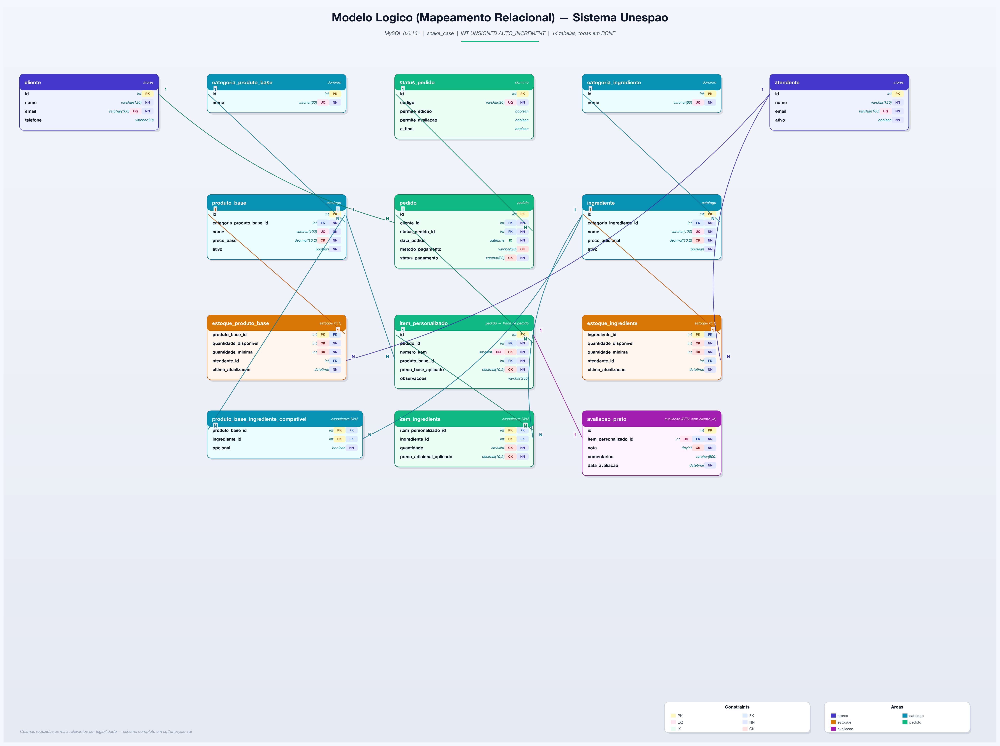

# 2. Modelo Lógico

Este capítulo apresenta a tradução do modelo conceitual (Capítulo 1) para o modelo
relacional, a normalização aplicada e a justificativa de cada decisão de projeto.
O modelo físico correspondente — tipos, restrições e índices efetivamente
implementados — está no Capítulo 3 e no script `sql/unespao.sql`.



**Figura 2** — Diagrama lógico do Sistema Unespão: 14 tabelas, agrupadas por área
(atores, catálogo, estoque, pedido, avaliação), com chaves e constraints. Note a
diferença em relação à Figura 1 (Capítulo 1): este diagrama já é o esquema
relacional normalizado, não o DER conceitual — em particular, `avaliacao_prato`
aqui **não tem** coluna `cliente_id` (ver §2.5), o que materializa o mapeamento
para o relacional cobrado no feedback do professor.

---

## 2.1 Método de mapeamento

A tradução do Diagrama Entidade-Relacionamento para o esquema relacional seguiu o
**algoritmo de mapeamento ER→Relacional de sete passos**:

| Passo | Regra | Onde foi aplicado neste projeto |
|---|---|---|
| 1 | Entidade forte → tabela; atributo-chave → chave primária | `cliente`, `atendente`, `categoria_produto_base`, `categoria_ingrediente`, `produto_base`, `ingrediente`, `status_pedido`, `pedido` |
| 2 | Atributo multivalorado → tabela própria com FK | Não aplicado — ver §2.3.1 |
| 3 | Entidade fraca → tabela com FK para a proprietária; PK = chave da proprietária + chave parcial | Avaliado e **substituído por chave substituta** em `item_personalizado` — ver §2.5 |
| 4 | Relacionamento 1:1 → FK no lado de participação total | `estoque_produto_base`, `estoque_ingrediente` |
| 5 | Relacionamento 1:N → PK do lado "1" vira FK no lado "N" | `produto_base`, `ingrediente`, `pedido`, `item_personalizado`, `avaliacao_prato` |
| 6 | Relacionamento M:N → tabela associativa com PK composta pelas duas FKs | `produto_base_ingrediente_compativel`, `item_ingrediente` |
| 7 | Relacionamento n-ário → tabela de referência cruzada com todas as FKs na PK | Não aplicado — o modelo conceitual não possui relacionamento de grau maior que 2 |

O esquema resultante tem **14 tabelas e 1 visão**, todas em **Forma Normal de
Boyce-Codd (BCNF)**.

---

## 2.2 Visão geral do esquema

> **Correspondência de nomenclatura entre os capítulos.** O modelo conceitual
> nomeia as entidades na notação do domínio (`ItemPersonalizado`,
> `ProdutoBase`), enquanto o modelo lógico e o físico nomeiam as tabelas em
> `snake_case` minúsculo (`item_personalizado`, `produto_base`). A mudança é
> deliberada e está justificada em §3.2 do modelo físico — decorre da
> portabilidade do script entre sistemas operacionais. A correspondência é
> um-para-um e está explicitada na coluna "Origem no conceitual" da tabela
> abaixo.

| # | Tabela | Origem no conceitual | Passo | FN |
|---|---|---|---|---|
| 1 | `cliente` | Entidade Cliente | 1 | BCNF |
| 2 | `atendente` | Entidade Atendente | 1 | BCNF |
| 3 | `categoria_produto_base` | Entidade CategoriaProdutoBase | 1 | BCNF |
| 4 | `categoria_ingrediente` | Entidade CategoriaIngrediente | 1 | BCNF |
| 5 | `produto_base` | Entidade ProdutoBase | 1 + 5 | BCNF |
| 6 | `ingrediente` | Entidade Ingrediente | 1 + 5 | BCNF |
| 7 | `produto_base_ingrediente_compativel` | Relacionamento M:N *compatível com* | **6** | BCNF |
| 8 | `estoque_produto_base` | Entidade Estoque (especializada) | **4** | BCNF |
| 9 | `estoque_ingrediente` | Entidade Estoque (especializada) | **4** | BCNF |
| 10 | `status_pedido` | Atributo Status promovido a entidade | 1 | BCNF |
| 11 | `pedido` | Entidade Pedido | 1 + 5 | BCNF |
| 12 | `item_personalizado` | Entidade fraca de Pedido | **3 → substituta** | BCNF |
| 13 | `item_ingrediente` | Relacionamento M:N *inclui* | **6** | BCNF |
| 14 | `avaliacao_prato` | Entidade AvaliacaoPrato | 5 + **3FN** | BCNF |
| — | `vw_pedido_total` (visão) | Atributo derivado ValorTotal | — | — |

---

## 2.3 As formas normais aplicadas ao projeto

As quatro decisões a seguir são as que efetivamente normalizaram o modelo. Cada
uma corresponde a uma forma normal, com exemplo extraído do próprio Sistema
Unespão.

### 2.3.1 Primeira Forma Normal — atributos atômicos e monovalorados

Uma tradução ingênua do conceitual poderia guardar a composição do lanche como
uma lista dentro de `item_personalizado`:

```
item_personalizado(id, produto_base_id, ingredientes = "queijo, alface, tomate")
```

Esse atributo é **multivalorado**, violando a 1FN. As consequências práticas são
diretas: não é possível consultar "quais itens levaram queijo", não é possível
somar os preços dos adicionais, e não há como garantir por chave estrangeira que
"queijo" exista de fato no catálogo. A solução é a tabela associativa
`item_ingrediente` (§2.6), que decompõe a lista em uma linha por ingrediente.

**Decisão de escopo — `cliente.telefone`:** manter o telefone como coluna única
só é válido sob a regra de negócio de **um telefone por cliente**, que o grupo
adotou. Caso o sistema passasse a admitir vários telefones, o atributo se tornaria
multivalorado e o **passo 2** do algoritmo exigiria uma tabela `telefone_cliente`.
Registra-se aqui a decisão para que a limitação seja explícita, e não uma omissão.

### 2.3.2 Segunda Forma Normal — sem dependência parcial da chave composta

As duas tabelas associativas do modelo têm chave primária composta, e são,
portanto, as únicas em que a 2FN pode ser violada. Em `item_ingrediente`, a chave
é `(item_personalizado_id, ingrediente_id)`. Se acrescentássemos ali a coluna
`nome_ingrediente`, ela dependeria **apenas de `ingrediente_id`** — metade da
chave —, configurando **dependência parcial** e violando a 2FN. O nome permanece
exclusivamente em `ingrediente`, e é recuperado por junção.

O mesmo raciocínio se aplica a `produto_base_ingrediente_compativel`: nenhum
atributo descritivo de produto ou de ingrediente é replicado ali. O único atributo
da tabela, `opcional`, depende da chave **inteira** — é justamente essa a sua
razão de existir (§2.4.2).

### 2.3.3 Terceira Forma Normal — sem dependência transitiva

Esta é a normalização central do projeto, e responde diretamente ao ponto do
modelo conceitual em que `AvaliacaoPrato` aparece vinculada **a dois**
identificadores: `Cliente` e `ItemPersonalizado`.

No modelo conceitual essa dupla ligação é legítima e desejável: ela comunica ao
leitor que a avaliação é feita *por um cliente* *sobre um prato*. **No modelo
lógico, porém, ela é redundante.** O cliente já é integralmente determinado pelo
caminho de chaves estrangeiras:

```
avaliacao_prato → item_personalizado → pedido → cliente
```

Manter a coluna `cliente_id` em `avaliacao_prato` criaria a cadeia de dependências

```
id → item_personalizado_id → pedido_id → cliente_id
```

em que `item_personalizado_id` **não é chave candidata** de `avaliacao_prato`.
Trata-se exatamente da definição de **dependência transitiva**: uma violação da
3ª Forma Normal.

O risco não é teórico. Com as duas colunas, o banco admitiria uma avaliação
registrada para o cliente A sobre um prato que consta ter sido pedido pelo cliente
B — um estado inconsistente que nenhuma restrição declarativa simples impediria.
Removida a coluna, a inconsistência torna-se **estruturalmente impossível**.

**Resultado:** `avaliacao_prato` possui uma única chave estrangeira,
`item_personalizado_id`, com restrição `UNIQUE` (uma avaliação por prato
consumido). O cliente avaliador é obtido por junção, como demonstrado na Consulta
2 (§2.8).

### 2.3.4 Forma Normal de Boyce-Codd

A BCNF exige que, para toda dependência funcional não trivial `X → A`, `X` seja
superchave. Verificando o esquema tabela a tabela:

- Nas tabelas com chave substituta simples, a única determinante é o `id`, que é
  superchave por definição.
- Em `cliente` e `atendente` há uma segunda chave candidata (`email`, declarada
  `UNIQUE`); como toda DF parte de uma das duas chaves candidatas, ambas
  permanecem em BCNF.
- Nas duas tabelas associativas, toda DF não trivial parte da chave composta
  completa.
- Nas duas tabelas de estoque, a única determinante é a chave primária, que é
  simultaneamente chave estrangeira.

**Nenhuma tabela do esquema apresenta determinante que não seja superchave.** O
modelo está integralmente em BCNF, sem necessidade de decomposição adicional.

A 4FN não foi objeto de análise específica: não há, no modelo, dependência
multivalorada não trivial — cada tabela associativa representa um único
relacionamento binário independente.

---

## 2.4 Correções de modelagem em relação à versão anterior

### 2.4.1 Estoque genérico → duas tabelas especializadas (passo 4)

A versão anterior do modelo conceitual tinha uma entidade `Estoque` com chave
própria e um atributo discriminador `TipoItem`, ligada tanto a `ProdutoBase`
quanto a `Ingrediente`. Traduzida literalmente, ela produziria:

```
estoque(id, tipo_item, item_id, quantidade_disponivel, ultima_atualizacao)
```

Esse é o antipadrão conhecido como **associação polimórfica**, e foi rejeitado por
três razões, todas verificáveis:

1. **Impossibilidade de chave estrangeira.** Nenhum SGBD relacional valida uma
   coluna contra duas tabelas distintas. A integridade referencial migraria para o
   código da aplicação — exatamente o que o modelo relacional existe para evitar.
2. **Tuplas espúrias.** Uma junção que omitisse o predicado
   `tipo_item = 'INGREDIENTE'` produziria linhas sem correspondência com o mundo
   real, violando a quarta diretriz informal de projeto.
3. **Semântica obscura do atributo.** `TipoItem` é metadado de estrutura, não um
   fato do negócio, contrariando a primeira diretriz informal.

**Alternativas avaliadas:**

| Alternativa | Avaliação |
|---|---|
| Mover `quantidade` como coluna de `produto_base` e `ingrediente` | Simples e normalizada, mas faz a entidade `Estoque` do conceitual desaparecer do lógico, e mistura catálogo (dado semi-estático) com estado operacional (dado volátil) |
| Uma tabela de estoque com duas FKs anuláveis + `CHECK` de exclusividade | Funciona, mas gera **NULLs por construção** em metade das linhas, contrariando a terceira diretriz informal (reduzir NULLs frequentes) |
| **Duas tabelas 1:1, PK = FK** ✔ | **Adotada** |

A solução adotada aplica o **passo 4** do algoritmo: o relacionamento é 1:1 com
participação total do lado do estoque, de modo que a chave da entidade
proprietária torna-se simultaneamente chave primária e chave estrangeira do lado
dependente. Isso elimina a chave substituta solta de `Estoque` — que era
justamente a causa-raiz da necessidade do discriminador — e produz integridade
referencial real, sem NULLs, nos dois lados.

**Contrapartida assumida:** o relatório de estoque baixo que abrange os dois tipos
exige `UNION ALL` (Consulta 3, §2.8). O custo é uma cláusula a mais na consulta;
o ganho é integridade garantida pelo SGBD.

### 2.4.2 `opcional` movido para a tabela associativa (passo 6)

Na versão anterior, `Opcional` era atributo da entidade `Ingrediente`. Isso afirma
algo que o negócio não sustenta: que ser opcional é propriedade intrínseca do
ingrediente. Na prática, o mesmo queijo pode ser **padrão** em um pão (já incluído
no preço base) e **adicional pago** em uma base de salada. O atributo estava,
portanto, alocado na entidade errada — violação da primeira diretriz informal
(semântica clara dos atributos).

A correção foi promover o relacionamento M:N entre `ProdutoBase` e `Ingrediente` a
tabela associativa própria — `produto_base_ingrediente_compativel`, pelo **passo
6** — e alocar `opcional` nela, onde o atributo depende da combinação completa
produto × ingrediente.

Essa tabela traz um segundo ganho, de regra de negócio: ela define **quais
ingredientes são combináveis com quais produtos base**. Sem ela, o banco aceitaria
brigadeiro em uma salada. A regra passa a ser verificável por consulta, e não
apenas convenção da interface.

### 2.4.3 `status` como texto livre → tabela de domínio

`Pedido.Status` era uma cadeia de caracteres sem domínio garantido. Foi promovido
à tabela `status_pedido`, com os seis estados do ciclo de vida do pedido:

| Código | Descrição | Permite edição | Permite avaliação | Final |
|---|---|---|---|---|
| `CRIADO` | Pedido em montagem pelo cliente | Sim | Não | Não |
| `AGUARDANDO_PAGAMENTO` | Enviado ao gateway | Sim | Não | Não |
| `PAGO` | Pagamento autorizado | Não | Não | Não |
| `EM_PREPARO` | Em produção na cozinha | Não | Não | Não |
| `CONCLUIDO` | Entregue ao cliente | Não | **Sim** | Sim |
| `CANCELADO` | Cancelado antes da confirmação | Não | Não | Sim |

As colunas `permite_edicao` e `permite_avaliacao` transformam em **dado** duas
regras de negócio do minimundo que, de outro modo, ficariam apenas no código da
aplicação: o cliente só pode editar ou cancelar itens **antes da confirmação do
pagamento**, e a avaliação do prato só ocorre **após a conclusão** do pedido.
Alterar a política passa a ser um `UPDATE`, não uma alteração de código.

### 2.4.4 Atributos derivados removidos

`Pedido.ValorTotal` e `ItemPersonalizado.PrecoTotal` foram **removidos** das
tabelas. Ambos são integralmente calculáveis a partir dos itens, e armazená-los
produziria redundância com anomalia de atualização clássica: alterada a composição
de um item, o total gravado passaria a mentir.

O argumento em favor de mantê-los — preservar o valor histórico quando o cardápio
mudar de preço — é legítimo, mas foi resolvido de forma melhor, **congelando o
preço no nível correto**:

- `item_personalizado.preco_base_aplicado` — cópia de `produto_base.preco_base` no
  instante da compra;
- `item_ingrediente.preco_adicional_aplicado` — cópia de
  `ingrediente.preco_adicional` no instante da compra.

Com esses dois instantâneos, o total do pedido é ao mesmo tempo **derivável** e
**imutável**: reajustar o cardápio amanhã não altera o valor de nenhum pedido de
ontem. O valor é devolvido à aplicação pela visão `vw_pedido_total`, sem custo de
redundância.

---

## 2.5 `item_personalizado`: entidade fraca com chave substituta

No modelo conceitual, `ItemPersonalizado` é **entidade fraca** de `Pedido`: não
existe fora de um pedido, e sua chave parcial é o número sequencial do item dentro
do pedido. A aplicação literal do **passo 3** do algoritmo produziria a chave
primária composta `(pedido_id, numero_item)`.

**Decisão adotada: chave substituta `id`, com a chave parcial preservada como
restrição de unicidade.**

**Justificativa.** `item_personalizado` é referenciada por duas outras tabelas.
Com a chave composta, `item_ingrediente` passaria a ter chave primária **tripla**
`(pedido_id, numero_item, ingrediente_id)`, e `avaliacao_prato` carregaria duas
colunas de chave estrangeira. A propagação de chaves compostas por múltiplos
níveis aumenta o tamanho de todos os índices secundários e torna as junções mais
verbosas, sem qualquer ganho de integridade.

**O que garante que a semântica de entidade fraca não se perde:**

1. `UQ_item_personalizado_pedido_numero UNIQUE (pedido_id, numero_item)` — impõe
   exatamente a mesma unicidade que a chave composta imporia. Não há estado do
   banco aceito por este esquema que a chave composta rejeitaria.
2. `FK_item_personalizado_pedido ... ON DELETE CASCADE` com `pedido_id NOT NULL` —
   impõe a **dependência existencial**: o item não pode existir sem pedido, e é
   removido junto com ele.

É um trade-off consciente entre a fidelidade literal ao passo 3 e a praticidade do
esquema físico, e não uma simplificação por descuido. A entidade permanece
documentada como fraca no modelo conceitual (Capítulo 1).

---

## 2.6 Definição das tabelas

Notação: `PK` chave primária · `FK` chave estrangeira · `UQ` única · `NN` não nula.

### `cliente` — BCNF
| Coluna | Tipo | Restrições |
|---|---|---|
| `id` | `INT UNSIGNED AUTO_INCREMENT` | **PK** |
| `nome` | `VARCHAR(120)` | NN |
| `telefone` | `VARCHAR(20)` | — |
| `email` | `VARCHAR(160)` | NN, **UQ** |
| `data_cadastro` | `DATETIME` | NN, default `CURRENT_TIMESTAMP` |

Passo 1. `email` é chave candidata natural, coerente com a autenticação por
provedor externo (OAuth Google).

### `atendente` — BCNF
| Coluna | Tipo | Restrições |
|---|---|---|
| `id` | `INT UNSIGNED AUTO_INCREMENT` | **PK** |
| `nome` | `VARCHAR(120)` | NN |
| `email` | `VARCHAR(160)` | NN, **UQ** |
| `ativo` | `BOOLEAN` | NN, default `TRUE` |
| `data_admissao` | `DATE` | — |

Passo 1. Segundo ator do minimundo, responsável pela manutenção de catálogo e
estoque; é referenciado pelas duas tabelas de estoque para rastrear quem realizou
a última atualização. `ativo` implementa exclusão lógica: o desligamento de um
funcionário não pode apagar o histórico de atualizações.

### `categoria_produto_base` / `categoria_ingrediente` — BCNF
| Coluna | Tipo | Restrições |
|---|---|---|
| `id` | `INT UNSIGNED AUTO_INCREMENT` | **PK** |
| `nome` | `VARCHAR(60)` | NN, **UQ** |
| `descricao` | `VARCHAR(255)` | — |

Passo 1. Tabelas de domínio. Sem elas, a categoria seria texto repetido em cada
produto: além da redundância, renomear uma categoria exigiria `UPDATE` em massa, e
guardar `descricao_categoria` junto ao produto criaria a dependência transitiva
`id → categoria → descricao`, violando a 3FN.

### `produto_base` — BCNF
| Coluna | Tipo | Restrições |
|---|---|---|
| `id` | `INT UNSIGNED AUTO_INCREMENT` | **PK** |
| `categoria_produto_base_id` | `INT UNSIGNED` | NN, **FK** → `categoria_produto_base(id)` |
| `nome` | `VARCHAR(100)` | NN, **UQ** |
| `descricao` | `VARCHAR(255)` | — |
| `preco_base` | `DECIMAL(10,2)` | NN, `CHECK >= 0` |
| `ativo` | `BOOLEAN` | NN, default `TRUE` |

Passo 1 + passo 5 (categoria 1:N produto).

### `ingrediente` — BCNF
| Coluna | Tipo | Restrições |
|---|---|---|
| `id` | `INT UNSIGNED AUTO_INCREMENT` | **PK** |
| `categoria_ingrediente_id` | `INT UNSIGNED` | NN, **FK** → `categoria_ingrediente(id)` |
| `nome` | `VARCHAR(100)` | NN, **UQ** |
| `preco_adicional` | `DECIMAL(10,2)` | NN, default `0.00`, `CHECK >= 0` |
| `ativo` | `BOOLEAN` | NN, default `TRUE` |

Passo 1 + passo 5. O antigo atributo `opcional` **não está aqui** — ver §2.4.2.

### `produto_base_ingrediente_compativel` — BCNF
| Coluna | Tipo | Restrições |
|---|---|---|
| `produto_base_id` | `INT UNSIGNED` | **PK** (parte), **FK** → `produto_base(id)` |
| `ingrediente_id` | `INT UNSIGNED` | **PK** (parte), **FK** → `ingrediente(id)` |
| `opcional` | `BOOLEAN` | NN, default `TRUE` |

**Passo 6** — relacionamento M:N *"ingrediente é compatível com produto base"*.
As duas FKs formam a PK composta; `opcional` é o atributo do próprio
relacionamento (`TRUE` = adicional pago; `FALSE` = já incluso no preço base).

### `estoque_produto_base` — BCNF
| Coluna | Tipo | Restrições |
|---|---|---|
| `produto_base_id` | `INT UNSIGNED` | **PK e FK** → `produto_base(id)` |
| `quantidade_disponivel` | `INT` | NN, default `0`, `CHECK >= 0` |
| `quantidade_minima` | `INT` | NN, default `0`, `CHECK >= 0` |
| `ultima_atualizacao` | `DATETIME` | NN, default e `ON UPDATE CURRENT_TIMESTAMP` |
| `atendente_id` | `INT UNSIGNED` | **FK** → `atendente(id)`, anulável |

**Passo 4** — 1:1 com participação total do lado do estoque: a chave da entidade
proprietária é, ao mesmo tempo, PK e FK. `quantidade_minima` é o limiar próprio de
cada item, o que permite que o alerta de estoque baixo (Consulta 3) seja
orientado a dado em vez de a um valor fixo embutido na consulta.

### `estoque_ingrediente` — BCNF
Estrutura idêntica à anterior, com `ingrediente_id` como **PK e FK** →
`ingrediente(id)`. Passo 4.

### `status_pedido` — BCNF
| Coluna | Tipo | Restrições |
|---|---|---|
| `id` | `INT UNSIGNED AUTO_INCREMENT` | **PK** |
| `codigo` | `VARCHAR(30)` | NN, **UQ** |
| `descricao` | `VARCHAR(120)` | NN |
| `permite_edicao` | `BOOLEAN` | NN, default `FALSE` |
| `permite_avaliacao` | `BOOLEAN` | NN, default `FALSE` |
| `e_final` | `BOOLEAN` | NN, default `FALSE` |

Passo 1. Ver §2.4.3 e a carga de domínio no script.

### `pedido` — BCNF
| Coluna | Tipo | Restrições |
|---|---|---|
| `id` | `INT UNSIGNED AUTO_INCREMENT` | **PK** |
| `cliente_id` | `INT UNSIGNED` | NN, **FK** → `cliente(id)` |
| `status_pedido_id` | `INT UNSIGNED` | NN, **FK** → `status_pedido(id)` |
| `data_pedido` | `DATETIME` | NN, default `CURRENT_TIMESTAMP` |
| `metodo_pagamento` | `VARCHAR(20)` | `CHECK` ∈ {PIX, CREDITO, DEBITO, DINHEIRO} ou nulo |
| `status_pagamento` | `VARCHAR(20)` | NN, default `'PENDENTE'`, `CHECK` ∈ {PENDENTE, AUTORIZADO, RECUSADO, ESTORNADO} |

Passo 5, aplicado duas vezes. **Sem `valor_total`** — ver §2.4.4.

O pagamento é processado por gateway externo; o banco registra apenas o meio
escolhido e a situação da transação. **Nenhum dado de cartão é armazenado** —
decisão de projeto alinhada ao objetivo de qualidade de segurança das transações.
`metodo_pagamento` é anulável porque, enquanto o pedido está em montagem, o
cliente ainda não escolheu a forma de pagamento.

Índices de apoio: `IX_pedido_cliente_data (cliente_id, data_pedido DESC)` para a
Consulta 1 e `IX_pedido_status (status_pedido_id)` para o painel operacional.

### `item_personalizado` — BCNF
| Coluna | Tipo | Restrições |
|---|---|---|
| `id` | `INT UNSIGNED AUTO_INCREMENT` | **PK** (substituta) |
| `pedido_id` | `INT UNSIGNED` | NN, **FK** → `pedido(id)` `ON DELETE CASCADE` |
| `numero_item` | `SMALLINT UNSIGNED` | NN, `CHECK >= 1` |
| `produto_base_id` | `INT UNSIGNED` | NN, **FK** → `produto_base(id)` |
| `preco_base_aplicado` | `DECIMAL(10,2)` | NN, `CHECK >= 0` |
| `observacoes` | `VARCHAR(255)` | — |
| | | **UQ** `(pedido_id, numero_item)` |

Entidade fraca com chave substituta — ver §2.5. A ausência de coluna
`quantidade` é deliberada: dois lanches iguais geram dois itens, porque cada item
carrega observações próprias.

### `item_ingrediente` — BCNF
| Coluna | Tipo | Restrições |
|---|---|---|
| `item_personalizado_id` | `INT UNSIGNED` | **PK** (parte), **FK** → `item_personalizado(id)` `ON DELETE CASCADE` |
| `ingrediente_id` | `INT UNSIGNED` | **PK** (parte), **FK** → `ingrediente(id)` |
| `quantidade` | `SMALLINT UNSIGNED` | NN, default `1`, `CHECK >= 1` |
| `preco_adicional_aplicado` | `DECIMAL(10,2)` | NN, default `0.00`, `CHECK >= 0` |

**Passo 6** — relacionamento M:N *"item personalizado inclui ingrediente"*, o
relacionamento central do domínio. É a tabela que resolve a 1FN (§2.3.1).
`quantidade` permite o pedido de porção dobrada de um mesmo ingrediente sem
duplicar a linha, o que violaria a chave primária.

### `avaliacao_prato` — 3FN e BCNF
| Coluna | Tipo | Restrições |
|---|---|---|
| `id` | `INT UNSIGNED AUTO_INCREMENT` | **PK** |
| `item_personalizado_id` | `INT UNSIGNED` | NN, **UQ**, **FK** → `item_personalizado(id)` `ON DELETE CASCADE` |
| `nota` | `TINYINT UNSIGNED` | NN, `CHECK BETWEEN 1 AND 5` |
| `comentarios` | `VARCHAR(500)` | — |
| `data_avaliacao` | `DATETIME` | NN, default `CURRENT_TIMESTAMP` |

Passo 5, com a **remoção da FK de cliente** por dependência transitiva — ver
§2.3.3. Esta é a principal decisão de normalização do projeto.

### `vw_pedido_total` — visão
Devolve à aplicação o atributo derivado `ValorTotal` removido de `pedido`,
recalculado a cada leitura a partir dos preços congelados nos itens. Colunas:
`pedido_id`, `cliente_id`, `cliente_nome`, `data_pedido`, `status_pedido`,
`status_pagamento`, `quantidade_itens`, `valor_total`.

---

## 2.7 Política de integridade referencial

O princípio aplicado: `CASCADE` apenas onde há **composição real** (o registro
filho não tem existência própria); `RESTRICT` onde há **referência histórica** que
não pode ser reescrita.

| Chave estrangeira | `ON DELETE` | `ON UPDATE` | Justificativa |
|---|---|---|---|
| `pedido → cliente` | `RESTRICT` | `CASCADE` | O histórico de vendas não pode ser destruído pela exclusão de um cliente |
| `pedido → status_pedido` | `RESTRICT` | `CASCADE` | Estado em uso não pode ser removido do domínio |
| `item_personalizado → pedido` | **`CASCADE`** | `CASCADE` | Composição: o item não existe fora do pedido |
| `item_personalizado → produto_base` | `RESTRICT` | `CASCADE` | Item de catálogo em histórico não é apagado (usa-se `ativo = FALSE`) |
| `item_ingrediente → item_personalizado` | **`CASCADE`** | `CASCADE` | Composição |
| `item_ingrediente → ingrediente` | `RESTRICT` | `CASCADE` | Catálogo referenciado por histórico |
| `avaliacao_prato → item_personalizado` | **`CASCADE`** | `CASCADE` | A avaliação não existe sem o prato avaliado |
| `estoque_produto_base → produto_base` | **`CASCADE`** | `CASCADE` | 1:1 dependente |
| `estoque_ingrediente → ingrediente` | **`CASCADE`** | `CASCADE` | 1:1 dependente |
| `estoque_* → atendente` | **`SET NULL`** | `CASCADE` | O registro de estoque sobrevive ao desligamento do atendente; perde-se apenas a autoria |
| `produto_base → categoria_produto_base` | `RESTRICT` | `CASCADE` | Categoria em uso não é removida |
| `ingrediente → categoria_ingrediente` | `RESTRICT` | `CASCADE` | Idem |
| `produto_base_ingrediente_compativel → ambos` | **`CASCADE`** | `CASCADE` | A compatibilidade é propriedade do par; sem um dos lados, perde o sentido |

`ON UPDATE CASCADE` é, neste esquema, uma declaração defensiva de intenção: com
chaves substitutas `AUTO_INCREMENT`, os valores de chave primária são imutáveis
por construção, de modo que a cláusula nunca é acionada na prática.

---

## 2.8 Consultas que demonstram as funcionalidades principais

As três consultas exigidas pelo enunciado estão implementadas ao final de
`sql/unespao.sql`. Juntas, elas percorrem as 14 tabelas.

### Consulta 1 — Histórico de pedidos de um cliente com a composição dos itens

**Funcionalidade:** montagem personalizada e histórico de pedidos — o insumo das
sugestões personalizadas.

Junta sete tabelas (`cliente`, `pedido`, `status_pedido`, `item_personalizado`,
`produto_base`, `categoria_produto_base`, `item_ingrediente`, `ingrediente`) e usa
`GROUP_CONCAT` para reconstituir a composição de cada lanche em uma única linha
legível. O preço do item é calculado a partir dos valores congelados, o que
**demonstra na prática que a remoção dos atributos derivados não fez o modelo
perder informação** (§2.4.4).

### Consulta 2 — Ranking de produtos base por avaliação média

**Funcionalidade:** avaliação de pratos e geração de sugestões personalizadas.

Usa `AVG`, `COUNT`, `GROUP BY` e `HAVING` — este último filtrando sobre o
agregado, em oposição ao `WHERE`, que filtra antes do agrupamento.

Esta consulta é a **justificativa empírica da normalização descrita em §2.3.3**:
enquanto a avaliação estava vinculada apenas ao cliente, não havia caminho de
junção até o produto avaliado, e a consulta era literalmente impossível de
escrever. Foi a normalização que tornou a funcionalidade viável.

### Consulta 3 — Alerta unificado de estoque baixo

**Funcionalidade:** controle de estoque com alerta de baixa quantidade — objetivo
de qualidade de prioridade alta do projeto.

Compara `quantidade_disponivel` com o limiar `quantidade_minima` de cada item e
reúne os dois tipos de estoque com `UNION ALL`, incluindo coluna discriminadora de
tipo e o atendente responsável pela última atualização. É também a contrapartida
explícita da decisão descrita em §2.4.1 — o custo da especialização, assumido em
troca de integridade referencial real.

---

## 2.9 Diagrama lógico

O diagrama lógico normalizado é gerado a partir do banco já criado, pela
funcionalidade **Reverse Engineer** do MySQL Workbench
(`Database → Reverse Engineer`), e está no Capítulo 3 / Apêndice. Gerar o diagrama
a partir do banco real, e não desenhá-lo à mão, garante que documento e
implementação não divirjam.
